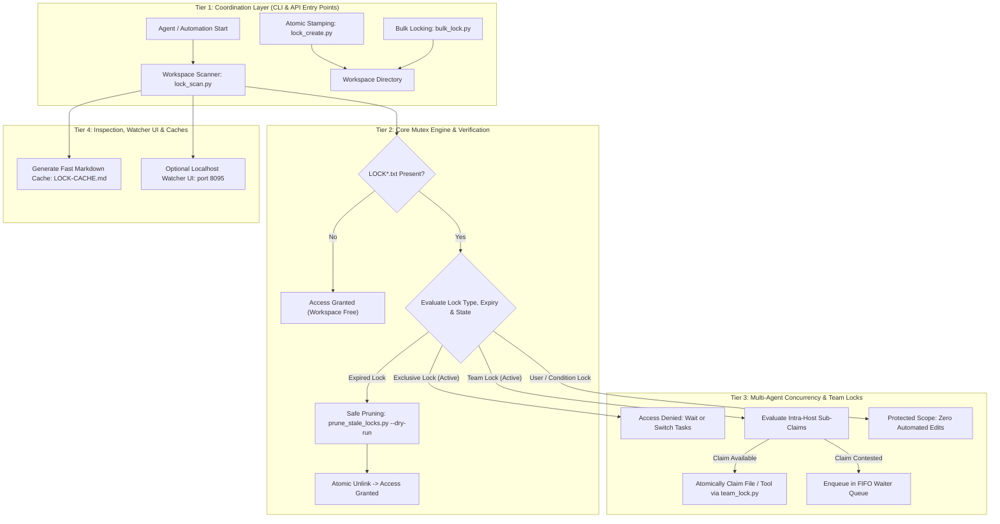

<p align="center"></p>

# lock-master

[](https://github.com/ellmos-ai/lock-master/actions/workflows/tests.yml)
[](#running-tests)
[](https://www.python.org/downloads/)
[](https://github.com/ellmos-ai/lock-master)
[](https://github.com/astral-sh/ruff)
[](SECURITY.md)
[](SECURITY.md)
[](SECURITY.md)
[](THIRD_PARTY_LICENSES.md)
[](THIRD_PARTY_LICENSES.md)
[](NOTICE)
[](THIRD_PARTY_LICENSES.md)
[](MARKETING-LOG.txt)
[](VERSION)
[](LICENSE)
[](llms.txt)
[](https://github.com/ellmos-ai)
[](https://github.com/open-bricks)

**EN** | [DE](README_de.md) | [ES](README_es.md) | [JA](README_ja.md) | [RU](README_ru.md) | [ZH](README_zh-Hans.md)

**Portable, zero-dependency multi-agent file-lock system — Exclusive and Team Locks (`LOCK*.txt`) with scopes, expiry, stale-cleanup, cloud-sync support, and a fast overview cache.**

> [!NOTE]
> **AI / LLM Indexing**: AI agents and automated tools can inspect [llms.txt](llms.txt) for a machine-readable summary, search terms, and disambiguation details. Last checked: **2026-09-20**.

### 🧭 Quick Navigation

1. [Executive Summary & Core Identity](#executive-summary--core-identity)
2. [Visual Architecture Topology & Decoupled Layers](#visual-architecture-topology)
3. [End-to-End Multi-Agent Locking & Lifecycle](#end-to-end-multi-agent-locking-lifecycle)
4. [Target Personas & High-Intent SEO Queries](#marketing--target-personas)
5. [Comparative Matrix vs. Alternatives](#comparative-matrix-vs-alternatives)
6. [Governance & Runtime Invariants Matrix](#governance--runtime-invariants)
7. [Core Capabilities & Lock Types](#core-capabilities--lock-types)
8. [Start Here & Quick Reference](#start-here)
9. [Quick Start & Common CLI Workflows](#quick-start)
10. [Configuration Reference (`lock_roots.json`)](#configuration)
11. [Optional Watcher UI & REST API](#optional-watcher-ui)
12. [Python API & Extension Points](#python-api)
13. [File Layout, Modules & Shims](#file-layout--shims)
14. [Testing, Verification & Quality Gates](#running-tests)
15. [Security Policy & Vulnerability SLAs](#security-policy)
16. [Third-Party Licenses & Level 1 SBOM](#third-party-licenses--transparency)
17. [Ecosystem, Sibling Tools & Bundles](#ecosystem--sibling-tools)
18. [Statutory Notice, Liability Limitation & License (§ 521 BGB)](#license)

---

## <a id="executive-summary--core-identity"></a><a id="discovery-context"></a><a id="what-is-lock-master"></a>1. Executive Summary & Core Identity

`lock-master` provides a lightweight, zero-dependency mutual exclusion and coordination protocol engineered for autonomous AI coding agents (Claude Code, OpenAI Codex, Antigravity/Gemini), background worker loops, and human maintainers operating across shared filesystem checkouts.

Instead of introducing heavyweight daemon dependencies or remote lock services, `lock-master` operates through transparent, human-readable plain-text files (`LOCK*.txt`). A lock file in any directory signals "this workspace or component is currently occupied" — strictly enforcing that no automated loop or secondary agent may alter files within that scope until the lock is actively released or cleanly expired.

### Core Value Propositions
- **100% Local-First & Zero-Egress**: Operates entirely within local filesystem boundaries without network calls, telemetry, or cloud dependencies.
- **Zero External Dependencies**: Pure Python standard library (3.10+) for all core locking, scanning, and stale pruning routines.
- **Multi-Agent & Swarm Ready**: Built-in intra-host Team Locks (`LOCK.team.<host>.txt`) with granular sub-claims for files, folders, and MCP tools.
- **Cloud-Sync Resilient**: Designed to handle cloud storage latency (OneDrive, Dropbox, Syncthing, Nextcloud) with host-scoped locking and rename-based atomic operations.
- **Fail-Closed Safety**: In the event of ambiguity, syntax errors, or unexpired locks, access is strictly denied (read-only safe default).

---

## <a id="visual-architecture-topology"></a><a id="features"></a><a id="features--architektur"></a>2. Visual Architecture Topology & Decoupled Layers

The following diagram illustrates the four decoupled operational tiers of `lock-master`, from CLI/API entry points down to persistent filesystem state and inspection tooling:



---

## <a id="end-to-end-multi-agent-locking-lifecycle"></a><a id="team-lock-and-sub-claims-lifecycle"></a>3. End-to-End Multi-Agent Locking & Lifecycle

The sequence diagram below shows how two autonomous AI agents coordinate within a shared workspace, handling exclusive locking, contested lock discovery, scoped parallelism, team sub-claims, and safe stale lock recovery:

```mermaid
sequenceDiagram
    autonumber
    actor AgentA as "Agent A (Claude Code)"
    participant LM as "lock-master Engine"
    participant FS as "Local Filesystem / Cloud-Sync"
    actor AgentB as "Agent B (Codex CLI)"
    participant Pruner as "Stale Lock Pruner"

    Note over AgentA,FS: Phase 1: Pre-Execution Lock Check & Exclusive Claim
    AgentA->>LM: Check workspace status: lock_utils.active_locks()
    LM->>FS: Scan for active LOCK*.txt
    FS-->>LM: Workspace clean (0 locks)
    LM-->>AgentA: Access granted (unlocked)
    AgentA->>LM: Stamp scoped lock: lock_create.py --scope api
    LM->>FS: Atomically write LOCK.api.txt (TTL: 24h)
    FS-->>AgentA: Lock confirmed

    Note over AgentB,FS: Phase 2: Contested Access & Scoped Parallelism
    AgentB->>LM: Attempt to modify api module: lock_utils.active_locks()
    LM->>FS: Read LOCK.api.txt (Active, Owner: Claude Code)
    LM-->>AgentB: Access Denied (Contested: api scope locked)
    AgentB->>LM: Switch to docs module: lock_create.py --scope docs
    LM->>FS: Atomically write LOCK.docs.txt
    FS-->>AgentB: Access granted (Parallel execution)

    Note over AgentA,AgentB: Phase 3: Intra-Host Team Coordination
    AgentA->>LM: Register team presence: team_lock.py presence
    LM->>FS: Atomically write LOCK.team.HOST_A.txt
    AgentA->>LM: Claim file: core/engine.py
    LM->>FS: Record sub-claim in LOCK.team.HOST_A.txt
    AgentB->>LM: Query sub-claims: team_lock.py claims
    LM-->>AgentB: core/engine.py claimed; tests/ available

    Note over AgentA,Pruner: Phase 4: Work Completion & Safe Stale Pruning
    AgentA->>FS: Complete refactoring -> Remove LOCK.api.txt
    alt Abandoned Process or Deadlock
        Pruner->>LM: Execute prune_stale_locks.py --dry-run
        LM->>FS: Inspect creation timestamp vs expires_after threshold
        Pruner->>LM: Execute prune_stale_locks.py
        LM->>FS: Atomically unlink expired LOCK.docs.txt
    else Normal Release
        AgentB->>FS: Remove LOCK.docs.txt upon completion
    end
```

---

## <a id="marketing--target-personas"></a><a id="target-personas"></a>4. Target Personas & High-Intent SEO Queries

`lock-master` is engineered to solve critical concurrency, coordination, and safety bottlenecks across four primary technical user journeys:

### [PERSONA-01] Autonomous AI Agent & Multi-Agent Swarm Engineers
- **Profile**: Lead AI Engineers, Framework Authors (Claude Code, OpenAI Codex, Antigravity/Gemini) deploying multi-agent swarms over common code checkouts.
- **Pain Points**: Heavyweight distributed lock managers (Redis Redlock, etcd, Consul) require running daemon processes, open network ports, credential provisioning, and fail catastrophically in local-first or offline developer workstations. Naive file flags cause race conditions and deadlocks without TTLs.
- **lock-master Solution**: Transparent plain-text `LOCK*.txt` and `LOCK.<scope>.txt` files readable and writable by any LLM agent or script with zero external dependencies. Autonomous timeout resolution, dry-run stale lock pruning, and hierarchical component scopes allow multiple agents to collaborate in parallel on separate modules without collisions.

### [PERSONA-02] Cloud-Sync & Multi-Device Workspace Developers
- **Profile**: Cross-device engineers synchronizing code repositories across Workstation, Laptop, and Server nodes using OneDrive, Dropbox, Nextcloud, or Syncthing.
- **Pain Points**: Traditional OS kernel locks (`flock`, `fcntl`, `LockFileEx`) are local to a single OS kernel and do not propagate across cloud synchronization providers. Cloud synchronization latency (30s to 5 minutes) creates conflicting edits, split-brain states, and corrupted files.
- **lock-master Solution**: Machine-scoped Team Locks (`LOCK.team.<host>.txt`) with intra-host agent sub-claims and rename-based atomic writes. Remote hosts recognize peer machine locks during sync latency windows and automatically defer file modifications.

### [PERSONA-03] Local-First, Zero-Egress & Air-Gapped Tool Builders
- **Profile**: Security-sensitive software developers, MCP server authors, and privacy engineers building air-gapped or zero-telemetry workflows.
- **Pain Points**: Coordination libraries that phone home, require remote auth tokens, or load bloated dependency trees introduce supply-chain vulnerabilities and fail air-gapped compliance audits.
- **lock-master Solution**: 100% Local-First and Zero-Egress by design (`INV-LOCAL-01`). Executes strictly within unprivileged user mode (`RunAsInvoker` / `INV-SEC-02`) with zero external runtime dependencies (`dependencies = []`), verified through automated AST import audits.

### [PERSONA-04] Enterprise Safety, Governance & Compliance Officers
- **Profile**: DevSecOps managers, Platform Compliance Officers, and Enterprise Architects requiring strict auditability, non-repudiation, and fail-closed safety.
- **Pain Points**: Opaque binary lock databases prevent human inspection. Crashed scripts leave persistent locks that require manual intervention or risky nuclear cleanup scripts.
- **lock-master Solution**: Human-readable ISO timestamps, declared owners, and explicit release conditions in plain text. Declarative `LOCK.permissions.json` rule evaluations with strict priority (`deny` > `ask` > `allow`), deterministic TTL expiration, Level 1 SBOM transparency, and guaranteed dual security SLAs (48h response / 5d triage).

### High-Intent Discovery Search Queries
- `multi-agent file locking python zero-dependency`
- `claude code codex shared workspace coordination lock files`
- `portable local-first mutex for ai coding agents`
- `cloud sync resilient locking onedrive dropbox python`
- `team lock sub-claims mcp tool mutex`
- `fail-closed declarative file lock permissions json`
- `safe stale lock pruning python dry-run`

---

## <a id="comparative-matrix-vs-alternatives"></a>5. Comparative Matrix vs. Alternatives

The following matrix compares `lock-master` against traditional file locking, distributed coordination systems, and database locks across our 10 Governance and Technical Invariants (`INV-LOCAL-01` to `INV-SLA-10`):

| # | Invariant & Evaluation Dimension | lock-master | OS Kernel Locking (`flock`/`fcntl`) | Distributed Lock (Redis Redlock/etcd) | DB Advisory Locks (SQLite/PostgreSQL) | Ad-Hoc Scripts / Shell Flag Files |
|---|:---|:---:|:---:|:---:|:---:|:---:|
| 1 | **INV-LOCAL-01: Zero-Egress & 100% Local-First** |  Zero network calls |  Local kernel only | ❌ Requires network daemon | ⚠️ Requires DB engine |  Local files |
| 2 | **INV-SEC-02: Unprivileged `RunAsInvoker`** |  Non-root user mode |  Kernel privilege limits | ⚠️ Service daemon credentials |  DB user privileges |  User mode |
| 3 | **INV-FAIL-03: Fail-Closed Default Semantics** |  Deny on error/ambiguity | ⚠️ Kernel error returns | ⚠️ Split-brain risk on network partition | ⚠️ Connection drop behavior | ❌ Race conditions / fail-open |
| 4 | **INV-SCOPE-04: Hierarchical & Scoped Locking** |  Project & component scopes | ❌ Single file descriptor | ⚠️ Manual key naming | ⚠️ Table/row scope only | ❌ Fixed file names |
| 5 | **INV-TEAM-05: Multi-Host Cloud-Sync Tolerance** |  Host-scoped Team Locks | ❌ Fails over cloud sync | ❌ Not suited for local sync folders | ❌ High risk of DB corruption | ❌ High race condition risk |
| 6 | **INV-TTL-06: Deterministic TTL & Dry-Run Pruning** |  Explicit TTL & dry-run | ❌ Process lifetime bound | ⚠️ Key TTL (no dry-run review) | ⚠️ Session bound / connection | ❌ Stale locks accumulate |
| 7 | **INV-PERM-07: Declarative Access Permissions** |  `LOCK.permissions.json` | ❌ OS permissions only | ⚠️ ACL / auth policies | ⚠️ DB role grants | ❌ None |
| 8 | **INV-AUDIT-08: Human-Readable & Atomic Cache** |  Plain text & `LOCK-CACHE.md` | ❌ Binary kernel state | ❌ Opaque binary KV storage | ❌ Binary database tables | ⚠️ Fragile plain text |
| 9 | **INV-LIC-09: 100% Permissive Zero-Copyleft** |  MIT License (0% copyleft) |  OS vendor license | ⚠️ BSD / SSPL / Apache | ⚠️ Public Domain / PostgreSQL |  Unspecified |
| 10 | **INV-SLA-10: 48h Response / 5d Triage SLA** |  Codified formal SLA | ❌ Upstream OS vendor | ⚠️ Commercial support only | ⚠️ Community forums | ❌ No maintenance SLA |

---

## <a id="governance--runtime-invariants"></a>6. Governance & Runtime Invariants Matrix

`lock-master` guarantees 10 fundamental runtime and governance invariants across all modules, CLI invocations, and multi-agent coordination layers:

| Canonical ID | Invariant Title | Core Operational Guarantee |
|:---|:---|:---|
| **INV-LOCAL-01** | **100% Local-First & Zero-Egress** | Operates strictly on local filesystems (including local cloud sync mounts like OneDrive/Dropbox). Never transmits telemetry, metrics, or network payloads. |
| **INV-SEC-02** | **Unprivileged Execution (`RunAsInvoker`)** | Runs entirely in standard unprivileged user mode. Never demands administrative elevation, sudo, or root access. |
| **INV-FAIL-03** | **Fail-Closed Locking Semantics** | In the presence of ambiguous lock states, parsing syntax errors, or active non-expired locks, access is strictly denied (safe read-only default). |
| **INV-SCOPE-04** | **Hierarchical & Scoped Locking** | Root `LOCK.txt` locks an entire project, while granular `LOCK.<scope>.txt` allows fine-grained concurrency across disjoint modules. |
| **INV-TEAM-05** | **Multi-Agent Team Coordination** | `LOCK.team.<host>.txt` coordinates intra-host agent teams (presence, file sub-claims, tool claims) while signaling remote hosts to stay out across sync latency. |
| **INV-TTL-06** | **Deterministic TTL & Stale Cleanup** | Every lock has an explicit `expires_after` duration (default 24h); stale locks are safely inspected via `--dry-run` and atomically pruned. |
| **INV-PERM-07** | **Declarative Permission Engine** | Evaluates action intents against `LOCK.permissions.json` using deterministic priority (`deny` > `ask` > `allow` > default) and regex path matching. |
| **INV-AUDIT-08** | **Read-Only Inspection & Atomic Cache** | `lock_scan.py` is read-only by default; cache exports (`LOCK-CACHE.md`) are written atomically without altering workspace lock states. |
| **INV-LIC-09** | **100% Permissive Dependency Stack** | Zero external runtime dependencies (Python standard library only); development and QA tools are strictly MIT/PSFL/BSD-3-Clause audited. |
| **INV-SLA-10** | **Dual Security Response SLA** | Committed 48-hour response and 5-business-day triage window via canonical security contacts (`security@open-bricks.org`, `security@ellmos.ai`). |

---

## <a id="core-capabilities--lock-types"></a><a id="core-capabilities"></a>7. Core Capabilities & Lock Types

### Lock File Types

- **Exclusive Lock (`LOCK.txt`)**: Locks the entire project directory tree for all systems and agents.
- **Scoped Lock (`LOCK.<scope>.txt`)**: Locks only a designated subcomponent (e.g. `LOCK.api.txt`, `LOCK.docs.txt`), allowing concurrent work on disjoint components.
- **Team Lock (`LOCK.team.<host>.txt`)**: Coordinates parallel agents running on the same host system. Combines presence tracking, file/folder claims, MCP/tool locks, and internal message passing in one file. Signals remote machines to back off.
- **User Lock (`LOCK.user.txt`)**: Placed directly by human operators. Never automatically expires or pruned; only removable by the human user.
- **Condition Lock (`LOCK.condition.<name>.txt`)**: Gates a specific operation until an explicit real-world condition is fulfilled (e.g. `release_condition: PR merged`). Never expires on time.

### File Format Specification

Plain text, key-value pairs formatted as `key: value`, UTF-8 encoded without BOM:

```text
owner: agent-name-or-human
created: 2026-06-14T10:00
host: workstation
expires_after: 24h
mode: hard
purpose: Refactoring authentication layer
release_condition: PR merged
operations: git-push, deploy
```

| Field | Required | Example | Description |
|:---|:---|:---|:---|
| `owner` | Yes | `claude-code`, `user` | Entity holding the lock. |
| `created` | Yes | `2026-06-14T10:00` | ISO-8601 timestamp for TTL base calculation. |
| `host` | Optional | `WORKSTATION-LG`, `LAPTOP` | Machine identifier (useful in multi-device setups). |
| `expires_after` | Optional | `24h`, `90m`, `2d` | TTL duration string (default: `24h`). Ignored for user/condition locks. |
| `purpose` | Optional | `Refactoring auth module` | Human-readable explanation of current task. |
| `mode` | Optional | `hard` \| `soft` | `hard` = no modifications (default); `soft` = read-only hints. |
| `release_condition` | Optional* | `All tests passing in CI` | Required for condition locks. |
| `operations` | Optional | `publish, push` | Comma-separated gated operations; unlisted actions remain permitted. |

---

## <a id="start-here"></a>8. Start Here & Quick Reference

| Common Need | Recommended Action | Command / Usage |
|:---|:---|:---|
| Prevent simultaneous agent edits on a repo | Stamp root exclusive lock | `python lock_create.py <project>` |
| Enable parallel agent work on separate modules | Stamp scoped component lock | `python lock_create.py <project> --scope api` |
| Scan active locks across all project roots | Run read-only scanner | `python lock_scan.py` |
| Export human-readable Markdown status page | Generate lock cache | `python lock_scan.py --write-cache` |
| Inspect expired/abandoned locks safely | Preview stale locks | `python prune_stale_locks.py --dry-run` |
| Safely remove verified expired locks | Execute stale pruning | `python prune_stale_locks.py` |
| Coordinate multi-agent swarm on one machine | Create host team lock | `python lock_create.py <project> --team <HOST>` |

---

## <a id="quick-start"></a>9. Quick Start & Common CLI Workflows

### 1. Copy or Install Scripts

Everything required for standard locking operations resides in `pure-locking/`:

```bash
pure-locking/lock_utils.py
pure-locking/lock_scan.py
pure-locking/prune_stale_locks.py
pure-locking/LOCK_TEMPLATE.txt
```

Place them side-by-side in your tooling directory or use the repository root shims.

### 2. Check Lock Status Before Starting Work

```bash
# Check if current directory is locked
python lock_scan.py --check-dir .
echo $?  # 0 = free to work; 1 = locked
```

### 3. Stamp a New Lock

```bash
# Exclusive project lock
python lock_create.py /path/to/project --owner "claude-code" --purpose "Refactoring core parser"

# Scoped component lock
python lock_create.py /path/to/project --scope frontend --owner "codex" --purpose "UI redesign"
```

### 4. Scan Workspace Hierarchy

```bash
# Human-readable console summary
python lock_scan.py

# Machine-readable JSON output for automated pipelines
python lock_scan.py --json
```

### 5. Safe Pruning of Stale Locks

```bash
# Preview what would be unlinked without making changes
python prune_stale_locks.py --dry-run

# Atomically prune expired locks
python prune_stale_locks.py
```

---

## <a id="configuration"></a>10. Configuration Reference (`lock_roots.json`)

To scan multiple project hierarchies, copy `pure-locking/lock_roots.example.json` to `lock_roots.json`:

```json
{
  "default_max_depth": 4,
  "shallow_depth": 2,
  "skip_dirs": [".git", ".venv", "node_modules", "__pycache__", "build", "dist"],
  "roots": [
    { "path": "C:/_Local_DEV/repos" },
    { "path": "C:/Users/user/OneDrive/Projects", "shallow": true }
  ],
  "caches": [
    {
      "name": "system-wide",
      "path": "C:/_Local_DEV/state/LOCK-CACHE.md"
    }
  ]
}
```

| Key | Type | Default | Description |
|:---|:---|:---|:---|
| `default_max_depth` | int | `4` | Maximum directory recursion depth for standard roots. |
| `shallow_depth` | int | `2` | Depth limit applied to roots marked `"shallow": true`. |
| `skip_dirs` | string[] | `[]` | Subdirectory names completely excluded from directory traversal. |
| `roots` | object[] | `[]` | List of `{ "path": string, "shallow": bool }` definitions. |
| `caches` | object[] | `[]` | Output destinations for Markdown status cache files. |

---

## <a id="optional-watcher-ui"></a>11. Optional Watcher UI & REST API

For visual fleet monitoring, `pure-locking/watcher/` provides an optional localhost dashboard and REST API binding strictly to `127.0.0.1:8095`:

```bash
# Launch background cache daemon
python pure-locking/watcher/lock_watcher.py --update-cache

# Launch localhost Web server
python pure-locking/watcher/web_server.py --port 8095
```

Navigate to `http://127.0.0.1:8095` to inspect active locks, component room maps, live timelines, and execute safe dry-run prunes.

---

## <a id="python-api"></a>12. Python API & Extension Points

Direct programmatic integration via `lock_utils`:

```python
from pathlib import Path
from datetime import datetime
import lock_utils

project_dir = Path("/path/to/my-repo")

# 1. Check workspace locking status
active = lock_utils.active_locks(project_dir)
if active:
    print(f"Workspace locked by active files: {[str(p.name) for p in active]}")
else:
    print("Workspace is free for modification.")

# 2. Parse lock metadata
lock_data = lock_utils.parse_lock_file(project_dir / "LOCK.txt")
print(f"Owner: {lock_data['owner']}, Created: {lock_data['created']}, Purpose: {lock_data['purpose']}")

# 3. Check expiry
if lock_utils.is_expired(project_dir / "LOCK.txt", now=datetime.now()):
    print("Lock has expired according to its TTL duration.")
```

---

## <a id="file-layout--shims"></a>13. File Layout, Modules & Shims

`lock-master` is structured as a stack of three decoupled sub-modules, unified with flat compatibility shims at the repository root:

```text
lock-master/                        # Shipped as ONE modular repository
├── pure-locking/                   # Core locking, scanning, and pruning engine
│   ├── lock_utils.py               # Core library: parse, scope, expiry, team-lock helpers
│   ├── lock_scan.py                # CLI: list active locks, write cache
│   ├── prune_stale_locks.py        # CLI: remove expired locks (--dry-run support)
│   ├── lock_create.py              # CLI: build correct lock filename and header
│   ├── bulk_lock.py                # CLI: lock/unlock multiple project roots
│   ├── watcher/                    # Optional localhost daemon, REST API, and Web UI
│   ├── LOCK_TEMPLATE.txt           # Template for exclusive locks
│   ├── TEAM_LOCK_TEMPLATE.txt      # Template for multi-agent team locks
│   └── lock_roots.example.json     # Example scanning configuration
├── permission-control/             # The LOCK.permissions.json rule engine
│   ├── permissions.py              # allow / deny / ask intent evaluation
│   └── LOCK_PERMISSIONS_TEMPLATE.json
├── team-lock/                      # Team-Lock CLI & intra-host concurrency
│   ├── team_lock.py                # CLI entry point for team claims & queues
│   └── _lock_master_team/          # FIFO queue, OS advisory guard, atomic writes
│
├── lock_scan.py                    # Root compatibility shim
├── lock_utils.py                   # Root compatibility shim
├── lock_create.py                  # Root compatibility shim
├── bulk_lock.py                    # Root compatibility shim
├── prune_stale_locks.py            # Root compatibility shim
├── permissions.py                  # Root compatibility shim
├── team_lock.py                    # Root compatibility shim (CLI: lock-master-team)
│
├── LOCK-SYSTEM.md                  # Canonical lock specification & lifecycle
├── NOTICE                          # Legal attribution notice (Lukas Geiger, ellmos-ai, open-bricks)
├── THIRD_PARTY_LICENSES.md         # Level 1 SBOM, license audit & invariant matrix
├── MARKETING-LOG.txt               # Personas, SEO queries & competitive analysis
├── SECURITY.md                     # Security policy, dual SLAs & vulnerability disclosure
├── llms.txt                        # AI agent discovery context & metadata
├── pyproject.toml                  # PEP 517/621/639 configuration (dependencies = [])
└── tests/                          # Automated contract and regression test suite
```

---

## <a id="running-tests"></a>14. Testing, Verification & Quality Gates

Run the comprehensive pytest test suite locally:

```bash
# Run all unit, functional, and metadata contract tests
python -m pytest tests/ -v

# Run Ruff linting check
python -m ruff check .
```

Our continuous integration matrix validates:
- Multi-OS execution (Ubuntu, Windows, macOS).
- Python matrix (3.10, 3.11, 3.12, 3.13).
- Bytecode compilation verification gate (`python -m compileall -q .`).
- Isolated wheel packaging smoke tests.
- 100% strict lint compliance via Ruff.

---

## <a id="security-policy"></a>15. Security Policy & Vulnerability SLAs

Security disclosures are handled under strict zero-egress, local-first protocols. See [SECURITY.md](SECURITY.md) for vulnerability disclosure guidelines, PGP keys, and our dual SLA commitments:
- **Initial Response SLA**: Within **48 hours** (`security@open-bricks.org`, `security@ellmos.ai`).
- **Triage & Assessment**: Within **5 business days**.
- **Remediation Target**: Fixes deployed within **30 calendar days**.

---

## <a id="third-party-licenses--transparency"></a><a id="third-party-licenses--level-1-sbom"></a>16. Third-Party Licenses & Level 1 SBOM

`lock-master` enforces a strict **Zero-Runtime-Dependency Guarantee** (`dependencies = []` in `pyproject.toml`) and is built exclusively with permissive open-source licenses (MIT, Apache-2.0, PSFL, BSD-3-Clause). It contains **zero GPL or restrictive copyleft code**.

For the complete Level 1 Software Bill of Materials (SBOM), audited dependency matrix, and Invariant Cross-Reference Matrix (`INV-LOCAL-01` to `INV-SLA-10`), see [THIRD_PARTY_LICENSES.md](THIRD_PARTY_LICENSES.md).

---

## <a id="ecosystem--sibling-tools"></a>17. Ecosystem, Sibling Tools & Bundles

`lock-master` is a foundational synchronization and locking pillar within the [ellmos-ai](https://github.com/ellmos-ai) ecosystem and the umbrella [open-bricks](https://github.com/open-bricks) open-source collective:

| Sibling Tool | Organization | Role & Capabilities |
|:---|:---|:---|
| [ticket-master](https://github.com/ellmos-ai/ticket-master) | ellmos-ai | Autonomous ticket routing and task dispatching triage console |
| [clutch](https://github.com/ellmos-ai/clutch) | ellmos-ai | Adaptive multi-model LLM router & agent execution gear |
| [coma](https://github.com/ellmos-ai/coma) | ellmos-ai | Single-binary multi-agent orchestrator & execution coordinator |
| [swarm-ai](https://github.com/ellmos-ai/swarm-ai) | ellmos-ai | Swarm intelligence and autonomous agent consensus engine |
| [gardener](https://github.com/ellmos-ai/gardener) | ellmos-ai | Local-first autonomous session and context memory engine |
| [system-gap-master](https://github.com/ellmos-ai/system-gap-master) | ellmos-ai | Serverless multi-agent workspace synchronization & reconciliation |
| [system-explorer](https://github.com/ellmos-ai/system-explorer) | ellmos-ai | Evidence-based function resolution & component drift auditor |
| [open-compute-mcp](https://github.com/ellmos-ai/open-compute-mcp) | ellmos-ai | Safe operator interaction, signal overlay & MCP computing bridge |
| [ellmos-filecommander-mcp](https://github.com/ellmos-ai/ellmos-filecommander-mcp) | ellmos-ai | High-performance filesystem & workspace operations MCP server |
| [ellmos-codecommander-mcp](https://github.com/ellmos-ai/ellmos-codecommander-mcp) | ellmos-ai | Semantic code analysis, AST inspection & refactoring MCP server |
| [n8n-manager-mcp](https://github.com/ellmos-ai/n8n-manager-mcp) | ellmos-ai | Safety-gated n8n workflow management & automation orchestrator |
| [prompt-evidence-collector](https://github.com/ellmos-ai/prompt-evidence-collector) | ellmos-ai | Audit-ready LLM interaction capture & cryptographic evidence store |
| [policy-registry](https://github.com/ellmos-ai/policy-registry) | ellmos-ai | Unified agent permission and policy management engine |
| [sqlite-transit-sync](https://github.com/ellmos-ai/sqlite-transit-sync) | ellmos-ai | Multi-agent state synchronization via SQLite WAL journals |
| [workflowhooker](https://github.com/ellmos-ai/workflowhooker) | ellmos-ai | Event hooks and agent workflow automation triggers |
| [memoryhooker](https://github.com/ellmos-ai/memoryhooker) | ellmos-ai | Transparent SQLite/FTS5 working memory capture for agents |
| [DevCenter](https://github.com/dev-bricks/DevCenter) | dev-bricks | Developer control plane, repository dashboard & environment manager |
| [CodeBox](https://github.com/dev-bricks/CodeBox) | dev-bricks | Polyglot code snippet manager & developer workbench |
| [safe-start-for-codex](https://github.com/dev-bricks/safe-start-for-codex) | dev-bricks | Safe starter and permission isolator for Codex CLI sessions |
| [automation-master](https://github.com/dev-bricks/automation-master) | dev-bricks | Automation orchestration and local job scheduler |
| [CleanMarkdown](https://github.com/doc-bricks/CleanMarkdown) | doc-bricks | Markdown formatting, linting, and structural sanitization toolkit |
| [PDFtoPDFocr](https://github.com/doc-bricks/PDFtoPDFocr) | doc-bricks | PDF OCR processing, searchable text layer embedding & validation |
| [open-bricks](https://github.com/open-bricks/open-bricks) | open-bricks | Umbrella catalog & cross-ecosystem architectural registry |

---

## <a id="license"></a><a id="statutory-notice-liability-limitation--license"></a>18. Statutory Notice, Liability Limitation & License (§ 521 BGB)

### Statutory Notice & Limitation of Liability (§ 521 BGB)
The provision of this software is made free of charge as a statutory courtesy (*Gefälligkeit* / *unentgeltliche Schenkung* pursuant to **§ 521 BGB** of the German Civil Code). Under German statutory law, liability of the author and contributors is strictly limited to intent and gross negligence (*Vorsatz und grobe Fahrlässigkeit*).

### License
This project is licensed under the terms of the **MIT License**. See [LICENSE](LICENSE) and [NOTICE](NOTICE) for complete copyright attribution.
