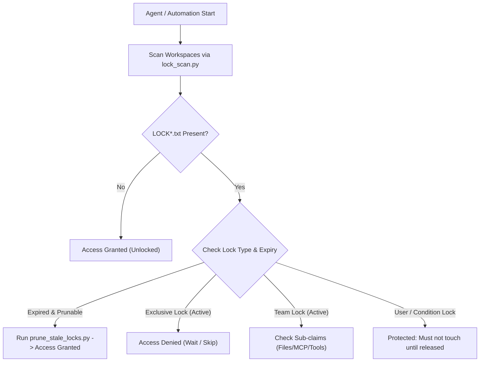

<p align="center"></p>

# lock-master

[](https://www.python.org/downloads/)
[](LICENSE)
[](#features)
[](#)
[](llms.txt)
[](https://github.com/ellmos-ai)
[](https://github.com/open-bricks)

**EN** | [DE](README_de.md) | [ES](README_es.md) | [JA](README_ja.md) | [RU](README_ru.md) | [ZH](README_zh-Hans.md)

**Portable, config-driven file-lock system for multi-agent project coordination.**

> [!NOTE]
> **AI / LLM Indexing**: AI agents and automated tools can inspect [llms.txt](llms.txt) for a machine-readable summary, search terms, and disambiguation details. Last checked: **2026-08-04**.

lock-master provides a lightweight, zero-dependency locking protocol based on
plain text files. A `LOCK*.txt` file in a project directory signals that the
project or a component is currently in use -- no agent, automation, or loop
should modify that area while a valid, non-expired lock exists.

---

## Start Here

| Need | Use |
|------|-----|
| Prevent two AI agents from editing the same repo at once | `LOCK.txt` in the project root |
| Let agents work in parallel on separate components | `LOCK.api.txt`, `LOCK.docs.txt`, or any other scoped lock |
| See all active locks across many project trees | `python lock_scan.py` |
| Publish a quick human-readable status page | `python lock_scan.py --write-cache` |
| Remove forgotten locks safely | `python prune_stale_locks.py --dry-run` first |
| Stamp a new lock without hand-editing the template | `python lock_create.py <project> [--scope docs] [--team HOST] [--user] [--condition]` |

## Discovery Context

Use lock-master when you need a portable coordination layer for Codex, Claude
Code, Gemini/agy, local automation loops, or human maintainers sharing the same
filesystem workspace. It is not a Redis mutex, database lock, Git branch lock,
padlock/security product, or cloud file-sharing API. The project name is best
searched together with terms such as `LOCK*.txt`, `multi-agent file locking`,
`AI agent project coordination`, and `Codex Claude lock files`.

---

## Features



- **Scope-based locking:** `LOCK.txt` locks the whole project; `LOCK.<scope>.txt` locks a component. Multiple agents can work in parallel on different scopes of the same project.
- **Team Locks:** `LOCK.team.<host>.txt` coordinates multiple agents within the same system internally — presence log, file claims, tool claims, and message board in one file. Other systems see the file and stay out.
- **Cloud-ready:** designed for OneDrive, Dropbox, and other shared filesystems. Team Locks are per-system to handle cloud-sync latency (30 s -- 5 min). Rename-based claims are atomic on NTFS and most cloud-sync filesystems.
- **Auto-expiry:** every lock has a configurable `expires_after` duration (default 24h). A stale-cleanup script removes forgotten locks.
- **Read-only scan:** `lock_scan.py` lists all active locks across configured roots without touching any files.
- **Markdown cache:** `lock_scan.py --write-cache` writes a `LOCK-CACHE.md` for instant status overview -- no scan needed.
- **Dry-run prune:** `prune_stale_locks.py --dry-run` previews what would be removed.
- **Optional local watcher UI:** `pure-locking/watcher/` adds a localhost daemon, REST API, and browser UI for live status, room maps, history, user locks, and prune actions.
- **Zero dependencies:** pure Python standard library (3.10+).
- **Config-driven:** all roots, depth limits, skip-dirs and cache targets live in `lock_roots.json` -- no hardcoded paths.

---

## Quick Start

### 1. Copy the scripts

Everything you need for plain locking lives in `pure-locking/`:

```
pure-locking/lock_utils.py
pure-locking/lock_scan.py
pure-locking/prune_stale_locks.py
pure-locking/LOCK_TEMPLATE.txt
```

Place them in a directory of your choice (e.g. `scripts/`). They import each
other flatly, so keep them side by side.

See [pure-locking/README.md](pure-locking/README.md) for what a partial
extraction does **not** include.

### 2. Create `lock_roots.json`

Copy `pure-locking/lock_roots.example.json`, rename it to `lock_roots.json`, and replace
the placeholder paths with your actual project roots. The file is excluded from
version control by `.gitignore` (it contains local absolute paths).

The optional watcher resolves this file in the following order:
`LOCK_MASTER_ROOTS_FILE`, local `pure-locking/lock_roots.json`, the active
Windows OneDrive location under `_scripts/lock_roots.json`, and finally
`~/OneDrive/_scripts/lock_roots.json`. If none exists, startup fails with the
complete list of checked paths instead of opening an empty or misleading UI.

```json
{
  "default_max_depth": 4,
  "shallow_depth": 2,
  "skip_dirs": [".git", ".venv", "node_modules", "__pycache__", "build", "dist"],
  "roots": [
    { "path": "/path/to/project-a" },
    { "path": "/path/to/project-b" },
    { "path": "/path/to/large-tree", "shallow": true }
  ],
  "caches": [
    {
      "name": "system-wide",
      "path": "/path/to/scripts/LOCK-CACHE.md"
    }
  ]
}
```

### 3. Create a lock

Copy `pure-locking/LOCK_TEMPLATE.txt` into your project directory, fill in the fields, and
rename it to `LOCK.txt` (or `LOCK.<scope>.txt` for component-level locking):

```
owner: my-agent
created: 2026-06-14T10:00
host: laptop
expires_after: 24h
mode: hard
purpose: Refactoring auth module
```

### 4. List active locks

```bash
python lock_scan.py
python lock_scan.py --json
```

### 5. Remove expired locks

```bash
# Preview (safe):
python prune_stale_locks.py --dry-run

# Actually remove:
python prune_stale_locks.py
```

### 6. Refresh the cache

```bash
python lock_scan.py --write-cache
```

Writes `LOCK-CACHE.md` as defined in the `"caches"` key of `lock_roots.json`.

---

## Optional Watcher UI

The `pure-locking/watcher/` directory contains an optional local daemon, REST API, and
browser UI. It uses the same `lock_roots.json`, `lock_scan.py`,
`lock_utils.py`, and `prune_stale_locks.py` from the repository root.

From the repository root:

```bash
python pure-locking/watcher/lock_watcher.py --update-cache
python pure-locking/watcher/web_server.py --port 8095
```

On Windows:

```bat
watcher\START.bat
```

Open:

```text
http://127.0.0.1:8095
```

Runtime data is stored outside the repository by default in
`~/.lock_master_watcher` and can be redirected with `LOCK_MASTER_WATCHER_DATA`.
See [pure-locking/watcher/README.md](pure-locking/watcher/README.md) for API and daemon details.

---

## Lock File Format

Plain text, one `key: value` per line. Lines starting with `#` are comments.

| Field               | Required | Example              | Meaning |
|---------------------|----------|----------------------|---------|
| `owner`             | yes      | `my-agent`           | Who holds the lock. |
| `created`           | yes      | `2026-06-14T10:00`   | ISO timestamp; base for expiry calculation. |
| `host`              | optional | `laptop`, `server`   | Machine that holds the lock (cross-system: which system locked it). |
| `expires_after`     | optional | `24h`, `90m`, `2d`   | Duration string. Default: `24h`. No effect on user/condition locks. |
| `release_condition` | optional* | `PR merged`         | Free-text: when can the lock be released. *Required for condition locks. |
| `operations`        | optional | `publish-release`    | Comma-separated list of the operations this lock forbids; everything not listed stays allowed. |
| `mode`              | optional | `hard` \| `soft`     | `hard` = no changes (default); `soft` = reads/hints ok. |
| `purpose`           | optional | `Adding feature X`   | Free-text description of what is running. |
| `scope`             | optional | `frontend`           | Informational; the **filename** is authoritative. |

If `created` is absent or unparseable, the file's mtime is used as fallback.

---

## Scope Convention

| Filename                          | Scope detected | What is locked |
|-----------------------------------|----------------|----------------|
| `LOCK.txt`                        | `project`      | Entire project directory |
| `LOCK.api.txt`                    | `api`          | Only the `api` component |
| `LOCK.frontend.txt`               | `frontend`     | Only the `frontend` component |
| `LOCK.my_scope.txt`               | `my_scope`     | Any freely named sub-area |
| `LOCK.team.LAPTOP.txt`            | `project`      | Team Lock -- whole project, system `LAPTOP` |
| `LOCK.team.api.LAPTOP.txt`        | `api`          | Team Lock -- `api` component, system `LAPTOP` |
| `LOCK.user.txt`                   | `project`      | User Lock -- removed only by the user, no time expiry |
| `LOCK.condition.publish.txt`      | `publish`      | Condition Lock -- holds until `release_condition` is met, no time expiry |

Detection regex: `^LOCK(\.[A-Za-z0-9_-]+(\.[A-Za-z0-9_-]+)*)?\.txt$` (case-insensitive).

**Condition locks** (v1.4.0) are for gating a *specific operation* on a *condition*
instead of a time window -- e.g. "no release upload until the review follow-ups are
merged". They never expire and are never pruned; any agent that verifiably fulfils
the `release_condition` may remove the lock (documenting the fulfilment). Combine
with the `operations:` field so that only the gated pipeline is blocked while all
other work continues. See LOCK-SYSTEM.md for the full rules.

---

## Team Locks

A **Team Lock** coordinates multiple agents running in parallel **on the same system** (e.g. a swarm of parallel Codex/Claude agents on one machine). It serves four purposes in a single file:

1. **Presence log** -- every agent checks in before working; checks out when done.
2. **File/folder claims + queue** -- who is editing what; who is waiting.
3. **Tool/software/MCP claims + queue** -- exclusive resources (DB connections, running servers, MCP tool sessions).
4. **Messages/tips** -- short handovers and warnings for teammates.

### Why per-system?

Cloud-sync latency (30 s -- 5 min with OneDrive or Dropbox) makes real-time cross-system locking unreliable. Each system manages its own agents via its own Team Lock; the presence of the file signals other systems to stay out.

### Team Lock lifecycle

```
CREATE (first agent)  -->  CHECK IN (each agent)  -->  WORK  -->  CHECK OUT  -->  DELETE (last agent)
```

- **Before touching files:** add your presence entry.
- **On task change:** update your file/tool claims immediately.
- **On exit:** remove your entry and claims; delete the file if you are the last.
- **Conflict copy (two systems wrote simultaneously):** one rename wins. The system whose file was overwritten must back off and retry.

### Creating a Team Lock

Copy `pure-locking/TEAM_LOCK_TEMPLATE.txt` into the project directory and fill in the header:

```
owner: agent-lead
created: 2026-06-19T10:00
host: LAPTOP
expires_after: 24h
purpose: Parallel refactor of auth module
```

Then add presence and claim entries under the relevant sections.

---

## Lifecycle

```
RESPECT  -->  CLAIM  -->  RELEASE
```

1. **RESPECT:** before starting work on a project or component, check for an
   active `LOCK*.txt` covering that area. If one exists and has not expired,
   choose a different task or wait.
2. **CLAIM:** create your lock file from the template (`owner`, `created`,
   `expires_after`, `purpose`).
3. **RELEASE:** **delete your own lock file** when done. Active release is
   required; the `expires_after` timeout is only a safety net for forgotten
   locks. If work takes longer than expected, renew `created` to prevent
   premature expiry.

---

## Configuration Reference (`lock_roots.json`)

| Key                 | Type     | Default | Description |
|---------------------|----------|---------|-------------|
| `default_max_depth` | int      | `4`     | Max directory recursion depth from each root. |
| `shallow_depth`     | int      | `2`     | Depth for roots marked `"shallow": true`. |
| `skip_dirs`         | string[] | `[]`    | Directory names to skip entirely (including subtree). |
| `roots`             | object[] | `[]`    | List of `{ "path": "...", "shallow": true/false }`. |
| `caches`            | object[] | `[]`    | Cache targets: `{ "name", "path", "filter_prefix?" }`. |

**Cache entry fields:**

| Key             | Required | Description |
|-----------------|----------|-------------|
| `name`          | yes      | Display name used as the cache title. |
| `path`          | yes      | Absolute path where `LOCK-CACHE.md` is written. |
| `filter_prefix` | optional | Only include locks whose path starts with this prefix. |

If `"caches"` is omitted, `--write-cache` writes a single `LOCK-CACHE.md`
next to `lock_scan.py`.

---

## Python API

```python
from pathlib import Path
import lock_utils

project = Path("/path/to/my-project")

# Check before starting work
active = lock_utils.active_locks(project)
if active:
    print(f"Locked: {active}")
else:
    print("Free to work.")

# Parse a specific lock file
data = lock_utils.parse_lock_file(project / "LOCK.txt")
print(data["owner"], data["created"])

# Check expiry
from datetime import datetime
expired = lock_utils.is_expired(project / "LOCK.txt", now=datetime.now())
```

---

## Running Tests

```bash
python -m pytest tests/ -v
```

Requires `pytest` (`pip install pytest`).

---

## Files

Since 2026-07-26 the repository is a **stack of three sub-modules**, shipped as
one module. Each sub-module carries its own `ellmos-module.v2.json` and a README
stating what a partial extraction does not include.

```
lock-master/                        # Stack -- shipped as ONE module
├── pure-locking/                   # The locking itself
│   ├── lock_utils.py               # Core library: parse, scope, expiry, team-lock helpers
│   ├── lock_scan.py                # CLI: list active locks, write cache
│   ├── prune_stale_locks.py        # CLI: remove expired locks
│   ├── lock_create.py              # CLI: build a correct lock filename and header
│   ├── bulk_lock.py                # CLI: lock/unlock many project roots at once
│   ├── watcher/                    # Optional localhost daemon, REST API, and Web UI
│   ├── LOCK_TEMPLATE.txt           # Template for creating an exclusive lock
│   ├── TEAM_LOCK_TEMPLATE.txt      # Template for creating a team lock
│   └── lock_roots.example.json     # Annotated example config
├── permission-control/             # The LOCK.permissions.json rule scheme
│   ├── permissions.py              # allow / deny / ask evaluation
│   └── LOCK_PERMISSIONS_TEMPLATE.json
├── team-lock/                      # Placeholder: atomic O_EXCL claims (planned)
│
├── lock_scan.py                    # Compatibility shims: the flat entry points
├── lock_utils.py                   #   keep working from the repository root.
├── lock_create.py                  #   Each loads the real module under its own
├── bulk_lock.py                    #   name, so `import lock_scan` yields the
├── prune_stale_locks.py            #   original, not a re-export.
├── permissions.py                  #
│
├── LOCK-SYSTEM.md                  # Canonical spec and lifecycle reference
├── KONZEPT-ZERLEGUNG.md            # Why the stack is split (German)
├── tests/
│   └── test_smoke.py               # Smoke tests
├── LICENSE                         # MIT
├── CHANGELOG.md
├── TODO.md
├── SECURITY.md
├── llms.txt
└── VERSION
```

---

## Requirements

- Python 3.10+
- No third-party dependencies (standard library only)
- For tests: `pytest`

---

## Part of the ellmos stack family

lock-master is deliberately both: a standalone dev tool and a core module of
the ellmos stack family.

Core module of [ellmos-ai/agent-ops-stack](https://github.com/ellmos-ai/agent-ops-stack)
(role `locking`); family/catalog: [ellmos-ai/stacks](https://github.com/ellmos-ai/stacks);
org overview: [ellmos-ai](https://github.com/ellmos-ai).

---

## License

MIT -- Copyright (c) 2026 Lukas Geiger. See [LICENSE](LICENSE).
