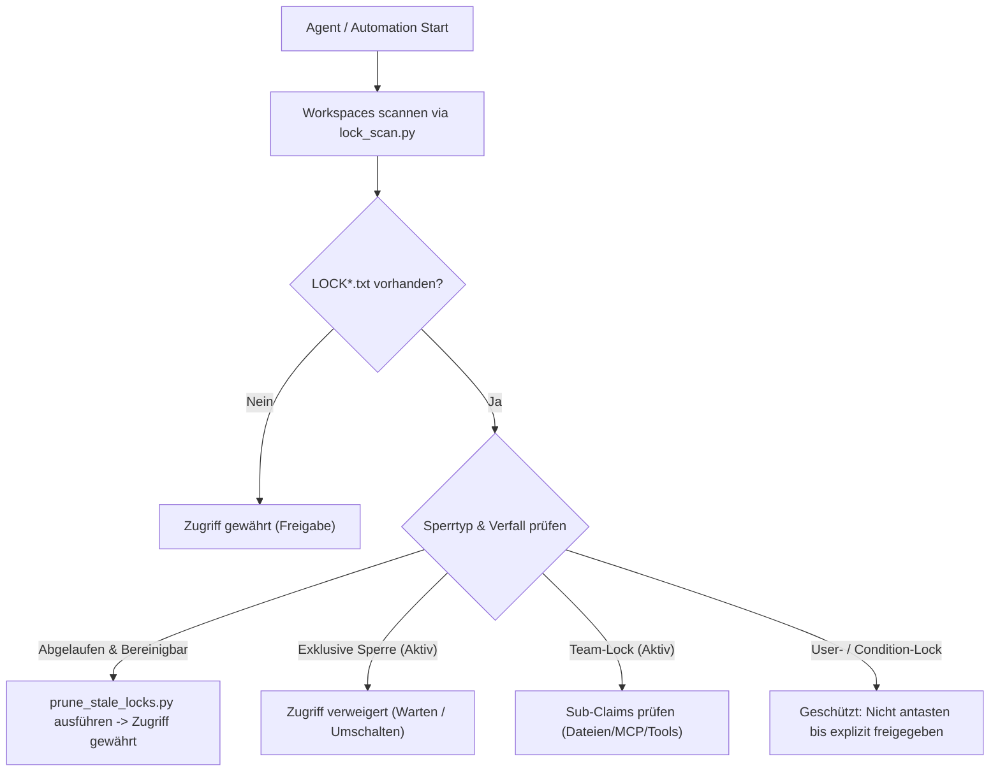

<p align="center"></p>

# lock-master

[](https://www.python.org/downloads/)
[](LICENSE)
[](#features)
[](#)
[](llms.txt)
[](https://github.com/ellmos-ai)
[](https://github.com/open-bricks)

[EN](README.md) | **DE** | [ES](README_es.md) | [JA](README_ja.md) | [RU](README_ru.md) | [ZH](README_zh-Hans.md)

**Portables, config-gesteuertes Datei-Sperrsystem für Multi-Agenten-Projektkoordination.**

> [!NOTE]
> **KI- / LLM-Indexierung**: KI-Agenten und automatisierte Werkzeuge können [llms.txt](llms.txt) für eine maschinenlesbare Zusammenfassung, Suchbegriffe und Disambiguation nutzen. Letzte Prüfung: **04.08.2026**.

lock-master bietet ein leichtgewichtiges, abhängigkeitsfreies Sperrprotokoll auf Basis von Klartextdateien. Eine `LOCK*.txt`-Datei in einem Projektordner signalisiert, dass das Projekt oder eine Komponente gerade in Bearbeitung ist -- kein Agent, keine Automation und kein autonomer Loop verändert diesen Bereich, solange eine gültige, nicht abgelaufene Sperre existiert.

---

## Einstieg

| Bedarf | Nutzen |
|--------|--------|
| Zwei KI-Agenten sollen nicht gleichzeitig dasselbe Repo bearbeiten | `LOCK.txt` im Projekt-Root |
| Agenten sollen parallel an getrennten Komponenten arbeiten | `LOCK.api.txt`, `LOCK.docs.txt` oder ein anderer Scope |
| Aktive Sperren über viele Projektbäume sehen | `python lock_scan.py` |
| Einen schnellen, menschenlesbaren Status veröffentlichen | `python lock_scan.py --write-cache` |
| Vergessene Sperren sicher entfernen | zuerst `python prune_stale_locks.py --dry-run` |
| Neue Sperre stempeln statt Template von Hand editieren | `python lock_create.py <projekt> [--scope docs] [--team HOST] [--user] [--condition]` |

## Auffindbarkeit und Abgrenzung

lock-master passt zu Codex, Claude Code, Gemini/agy, lokalen Automationsloops
und menschlichen Maintainern, die denselben Dateisystem-Workspace teilen. Es ist
kein Redis-Mutex, keine Datenbanksperre, kein Git-Branch-Lock, kein Türschloss
und keine Cloud-Dateifreigabe-API. Gute Suchphrasen kombinieren den Projektnamen
mit `LOCK*.txt`, `Multi-Agenten-Dateisperre`, `KI-Agenten-Projektkoordination`
oder `Codex Claude Lock-Dateien`.

---

## Features



- **Scope-basiertes Sperren:** `LOCK.txt` sperrt das gesamte Projekt; `LOCK.<scope>.txt` sperrt eine Komponente. Mehrere Agenten können parallel an verschiedenen Scopes desselben Projekts arbeiten.
- **Team-Locks:** `LOCK.team.<host>.txt` koordiniert mehrere Agenten desselben Systems intern -- Anwesenheitslog, Datei-Claims, Tool-Claims und Nachrichtenbrett in einer Datei. Andere Systeme sehen die Datei und bleiben draußen.
- **Cloud-Ready:** konzipiert für OneDrive, Dropbox und andere geteilte Dateisysteme. Team-Locks sind pro System, um mit Cloud-Sync-Latenz (30 s -- 5 min) umzugehen. Rename-basierte Claims sind auf NTFS und den meisten Cloud-Sync-Dateisystemen atomar.
- **Auto-Verfall:** jede Sperre hat eine konfigurierbare `expires_after`-Dauer (Standard 24h). Ein Cleanup-Script entfernt vergessene Sperren.
- **Read-only-Scan:** `lock_scan.py` listet alle aktiven Sperren über alle konfigurierten Roots, ohne Dateien zu verändern.
- **Markdown-Cache:** `lock_scan.py --write-cache` schreibt eine `LOCK-CACHE.md` für einen schnellen Überblick ohne Scan.
- **Dry-run-Prune:** `prune_stale_locks.py --dry-run` zeigt vorab, was entfernt würde.
- **Optionale lokale Watcher-UI:** `pure-locking/watcher/` ergänzt Daemon, REST-API und Browser-UI auf localhost für Live-Status, Raumkarte, Verlauf, Userlocks und Prune-Aktionen.
- **Keine Abhängigkeiten:** reine Python-Standardbibliothek (3.10+).
- **Config-gesteuert:** alle Roots, Tiefenbegrenzungen, Skip-Verzeichnisse und Cache-Ziele liegen in `lock_roots.json` -- keine hartkodierten Pfade im Code.

---

## Schnellstart

### 1. Scripts kopieren

Alles, was reines Sperren braucht, liegt in `pure-locking/`:

```
pure-locking/lock_utils.py
pure-locking/lock_scan.py
pure-locking/prune_stale_locks.py
pure-locking/LOCK_TEMPLATE.txt
```

In ein Verzeichnis deiner Wahl legen (z. B. `scripts/`). Die Dateien importieren
einander flach, müssen also nebeneinander liegen.

Was bei einer Teilentnahme **fehlt**, steht in
[pure-locking/README.md](pure-locking/README.md).

### 2. `lock_roots.json` erstellen

`pure-locking/lock_roots.example.json` kopieren, zu `lock_roots.json` umbenennen und die Platzhalter-Pfade durch echte Projektpfade ersetzen. Die Datei wird von `.gitignore` ausgeschlossen (sie enthält lokale absolute Pfade).

Der optionale Watcher löst diese Datei in folgender Reihenfolge auf:
`LOCK_MASTER_ROOTS_FILE`, lokale `pure-locking/lock_roots.json`, die aktive
Windows-OneDrive-Position unter `_scripts/lock_roots.json` und zuletzt
`~/OneDrive/_scripts/lock_roots.json`. Wird keine Datei gefunden, bricht der
Start mit allen geprüften Pfaden ab, statt eine leere oder irreführende Ansicht
zu öffnen.

```json
{
  "default_max_depth": 4,
  "shallow_depth": 2,
  "skip_dirs": [".git", ".venv", "node_modules", "__pycache__", "build", "dist"],
  "roots": [
    { "path": "/pfad/zu/projekt-a" },
    { "path": "/pfad/zu/projekt-b" },
    { "path": "/pfad/zu/grossem-baum", "shallow": true }
  ],
  "caches": [
    {
      "name": "systemweit",
      "path": "/pfad/zu/scripts/LOCK-CACHE.md"
    }
  ]
}
```

### 3. Sperre anlegen

`pure-locking/LOCK_TEMPLATE.txt` in den Projektordner kopieren, Felder ausfüllen und in `LOCK.txt` (oder `LOCK.<scope>.txt` für Komponenten-Sperren) umbenennen:

```
owner: mein-agent
created: 2026-06-14T10:00
host: laptop
expires_after: 24h
mode: hard
purpose: Auth-Modul refaktorieren
```

### 4. Aktive Sperren anzeigen

```bash
python lock_scan.py
python lock_scan.py --json
```

### 5. Abgelaufene Sperren entfernen

```bash
# Vorschau (löscht nichts):
python prune_stale_locks.py --dry-run

# Tatsächlich entfernen:
python prune_stale_locks.py
```

### 6. Cache aktualisieren

```bash
python lock_scan.py --write-cache
```

Schreibt `LOCK-CACHE.md` gemäß den Einträgen im `"caches"`-Schlüssel von `lock_roots.json`.

---

## Optionale Watcher-UI

Der Ordner `pure-locking/watcher/` enthält einen optionalen lokalen Daemon, eine
REST-API und eine Browser-UI. Er nutzt dieselbe `lock_roots.json`, `lock_scan.py`,
`lock_utils.py` und `prune_stale_locks.py` aus `pure-locking/`.

Aus dem Repo-Root:

```bash
python pure-locking/watcher/lock_watcher.py --update-cache
python pure-locking/watcher/web_server.py --port 8095
```

Unter Windows:

```bat
pure-locking\watcher\START.bat
```

Öffnen:

```text
http://127.0.0.1:8095
```

Runtime-Daten liegen standardmäßig außerhalb des Repos in
`~/.lock_master_watcher` und können mit `LOCK_MASTER_WATCHER_DATA` umgeleitet
werden. Details zu API und Daemon stehen in
[pure-locking/watcher/README.md](pure-locking/watcher/README.md).

---

## Lock-Dateiformat

Klartext, eine `key: value`-Einstellung pro Zeile. Zeilen mit `#` sind Kommentare.

| Feld                | Pflicht | Beispiel             | Bedeutung |
|---------------------|---------|----------------------|-----------|
| `owner`             | ja      | `mein-agent`         | Wer hält die Sperre. |
| `created`           | ja      | `2026-06-14T10:00`   | ISO-Zeitstempel; Basis für Verfallsberechnung. |
| `host`              | optional | `laptop`, `server`  | Maschine, die die Sperre hält (cross-system: welches System sperrt). |
| `expires_after`     | optional | `24h`, `90m`, `2d`  | Dauer-String. Standard: `24h`. |
| `release_condition` | optional | `PR gemergt`        | Freitext: wann kann die Sperre freigegeben werden. |
| `mode`              | optional | `hard` \| `soft`    | `hard` = keine Änderungen (Standard); `soft` = Lesen/Hinweis ok. |
| `purpose`           | optional | `Feature X hinzufügen` | Freitext-Beschreibung der laufenden Arbeit. |
| `scope`             | optional | `frontend`           | Nur informativ; der **Dateiname** ist autoritativ. |

Fehlt `created` oder ist nicht parsebar, wird die Datei-mtime als Fallback verwendet.

---

## Scope-Konvention

| Dateiname                         | Erkannter Scope | Was gesperrt ist |
|-----------------------------------|-----------------|------------------|
| `LOCK.txt`                        | `project`       | Gesamtes Projektverzeichnis |
| `LOCK.api.txt`                    | `api`           | Nur die `api`-Komponente |
| `LOCK.frontend.txt`               | `frontend`      | Nur die `frontend`-Komponente |
| `LOCK.my_scope.txt`               | `my_scope`      | Beliebig benannter Teilbereich |
| `LOCK.team.LAPTOP.txt`            | `project`       | Team-Lock -- gesamtes Projekt, System `LAPTOP` |
| `LOCK.team.api.LAPTOP.txt`        | `api`           | Team-Lock -- `api`-Komponente, System `LAPTOP` |

Erkennungsregex: `^LOCK(\.[A-Za-z0-9_-]+(\.[A-Za-z0-9_-]+)*)?\.txt$` (case-insensitive).

---

## Team-Locks

Ein **Team-Lock** koordiniert mehrere Agenten, die **auf demselben System** parallel laufen (z. B. ein Schwarm paralleler Codex/Claude-Agenten auf einer Maschine). Er erfüllt vier Aufgaben in einer Datei:

1. **Anwesenheitslog** -- jeder Agent trägt sich vor der Arbeit ein und aus, wenn er fertig ist.
2. **Datei-/Ordner-Claims + Warteschlange** -- wer bearbeitet was; wer wartet.
3. **Tool-/Software-/MCP-Claims + Warteschlange** -- exklusive Ressourcen (DB-Verbindungen, laufende Server, MCP-Tool-Sessions).
4. **Nachrichten/Tipps** -- kurze Übergaben und Warnungen für Teammitglieder.

### Warum pro System?

Cloud-Sync-Latenz (30 s -- 5 min bei OneDrive oder Dropbox) macht systemübergreifende Echtzeit-Sperren unzuverlässig. Jedes System verwaltet seine eigenen Agenten über seinen eigenen Team-Lock; die Präsenz der Datei signalisiert anderen Systemen: draußen bleiben.

### Team-Lock-Lebenszyklus

```
ANLEGEN (erster Agent)  -->  EINCHECKEN (jeder Agent)  -->  ARBEITEN  -->  AUSCHECKEN  -->  LÖSCHEN (letzter Agent)
```

- **Vor dem Bearbeiten von Dateien:** eigenen Anwesenheitseintrag hinzufügen.
- **Bei Aufgabenwechsel:** Datei-/Tool-Claims sofort aktualisieren.
- **Beim Verlassen:** eigenen Eintrag und Claims entfernen; Datei löschen, wenn man der letzte ist.
- **Konfliktkopie (zwei Systeme haben gleichzeitig geschrieben):** ein Rename gewinnt. Das System, dessen Datei überschrieben wurde, muss zurückrollen und es erneut versuchen.

### Team-Lock anlegen

`pure-locking/TEAM_LOCK_TEMPLATE.txt` in den Projektordner kopieren und den Header ausfüllen:

```
owner: agent-lead
created: 2026-06-19T10:00
host: LAPTOP
expires_after: 24h
purpose: Paralleles Refactoring des Auth-Moduls
```

Dann Anwesenheits- und Claim-Einträge in den entsprechenden Abschnitten ergänzen.

---

## Lebenszyklus

```
BEACHTEN  -->  CLAIMEN  -->  FREIGEBEN
```

1. **BEACHTEN:** Vor Arbeitsbeginn an einem Projekt oder einer Komponente prüfen, ob eine aktive `LOCK*.txt` für den betroffenen Bereich existiert. Wenn ja und nicht abgelaufen: anderes Projekt wählen oder warten.
2. **CLAIMEN:** eigene Lock-Datei nach Vorlage anlegen (`owner`, `created`, `expires_after`, `purpose`).
3. **FREIGEBEN:** die **selbst angelegte Lock-Datei löschen**, wenn fertig. Aktives Freigeben durch den Ersteller ist Pflicht; der `expires_after`-Timeout ist nur ein Sicherheitsnetz für vergessene Sperren. Bei längerer Laufzeit `created` erneuern, damit die Sperre nicht vorzeitig verfällt.

---

## Konfigurationsreferenz (`lock_roots.json`)

| Schlüssel           | Typ      | Standard | Beschreibung |
|---------------------|----------|----------|--------------|
| `default_max_depth` | int      | `4`      | Maximale Rekursionstiefe ab jedem Root. |
| `shallow_depth`     | int      | `2`      | Tiefe für Roots mit `"shallow": true`. |
| `skip_dirs`         | string[] | `[]`     | Verzeichnisnamen, die komplett übersprungen werden (inkl. Unterbaum). |
| `roots`             | object[] | `[]`     | Liste von `{ "path": "...", "shallow": true/false }`. |
| `caches`            | object[] | `[]`     | Cache-Ziele: `{ "name", "path", "filter_prefix?" }`. |

**Cache-Eintrags-Felder:**

| Schlüssel       | Pflicht | Beschreibung |
|-----------------|---------|--------------|
| `name`          | ja      | Anzeigename, der als Cache-Titel verwendet wird. |
| `path`          | ja      | Absoluter Pfad, in den `LOCK-CACHE.md` geschrieben wird. |
| `filter_prefix` | optional | Nur Locks einschließen, deren Pfad mit diesem Präfix beginnt. |

Fehlt `"caches"`, schreibt `--write-cache` eine einzige `LOCK-CACHE.md` neben `lock_scan.py`.

---

## Python-API

```python
from pathlib import Path
import lock_utils

projekt = Path("/pfad/zu/meinem-projekt")

# Vor Arbeitsbeginn prüfen
aktiv = lock_utils.active_locks(projekt)
if aktiv:
    print(f"Gesperrt: {aktiv}")
else:
    print("Frei zum Arbeiten.")

# Eine konkrete Lock-Datei parsen
data = lock_utils.parse_lock_file(projekt / "LOCK.txt")
print(data["owner"], data["created"])

# Verfall prüfen
from datetime import datetime
abgelaufen = lock_utils.is_expired(projekt / "LOCK.txt", now=datetime.now())
```

---

## Tests ausführen

```bash
python -m pytest tests/ -v
```

Erfordert `pytest` (`pip install pytest`).

---

## Dateistruktur

Seit dem 26.07.2026 ist das Repository ein **Stack aus drei Teilmodulen**, der
als ein Modul ausgeliefert wird. Jedes Teilmodul hat ein eigenes
`ellmos-module.v2.json` und eine README, die sagt, was bei einer Teilentnahme
fehlt.

```
lock-master/                        # Stack -- wird als EIN Modul ausgeliefert
├── pure-locking/                   # Das Sperren selbst
│   ├── lock_utils.py               # Kernbibliothek: Parsen, Scope, Verfall, Team-Lock-Hilfsfunktionen
│   ├── lock_scan.py                # CLI: aktive Sperren auflisten, Cache schreiben
│   ├── prune_stale_locks.py        # CLI: abgelaufene Sperren entfernen
│   ├── lock_create.py              # CLI: korrekten Lock-Dateinamen und Header bauen
│   ├── bulk_lock.py                # CLI: viele Projektordner auf einmal sperren
│   ├── watcher/                    # Optionale localhost-Daemon-, REST-API- und Web-UI
│   ├── LOCK_TEMPLATE.txt           # Vorlage für neue Exclusive-Lock-Dateien
│   ├── TEAM_LOCK_TEMPLATE.txt      # Vorlage für neue Team-Lock-Dateien
│   └── lock_roots.example.json     # Annotiertes Beispiel-Config
├── permission-control/             # Das Regelschema LOCK.permissions.json
│   ├── permissions.py              # Auswertung allow / deny / ask
│   └── LOCK_PERMISSIONS_TEMPLATE.json
├── team-lock/                      # Platzhalter: atomare O_EXCL-Claims (geplant)
│
├── lock_scan.py                    # Kompatibilitäts-Shims: die flachen Einstiegs-
├── lock_utils.py                   #   punkte funktionieren weiter aus dem Repo-Root.
├── lock_create.py                  #   Jeder lädt das echte Modul unter dem eigenen
├── bulk_lock.py                    #   Namen, `import lock_scan` liefert also das
├── prune_stale_locks.py            #   Original und keinen Re-Export.
├── permissions.py                  #
│
├── LOCK-SYSTEM.md                  # Kanonische Spec und Lebenszyklus-Referenz
├── KONZEPT-ZERLEGUNG.md            # Warum der Stack zerlegt wurde
├── tests/
│   └── test_smoke.py               # Smoke-Tests
├── LICENSE                         # MIT
├── CHANGELOG.md
├── TODO.md
├── SECURITY.md
├── llms.txt
└── VERSION
```

---

## Anforderungen

- Python 3.10+
- Keine Drittanbieter-Abhängigkeiten (nur Standardbibliothek)
- Für Tests: `pytest`

---

## Teil der ellmos-Stack-Familie

lock-master ist bewusst beides: ein eigenständiges Dev-Tool und ein Kernmodul
der ellmos-Stack-Familie.

Kernmodul von [ellmos-ai/agent-ops-stack](https://github.com/ellmos-ai/agent-ops-stack)
(Rolle `locking`); Familie/Katalog: [ellmos-ai/stacks](https://github.com/ellmos-ai/stacks);
Org-Übersicht: [ellmos-ai](https://github.com/ellmos-ai).

---

## Lizenz

MIT -- Copyright (c) 2026 Lukas Geiger. Siehe [LICENSE](LICENSE).
