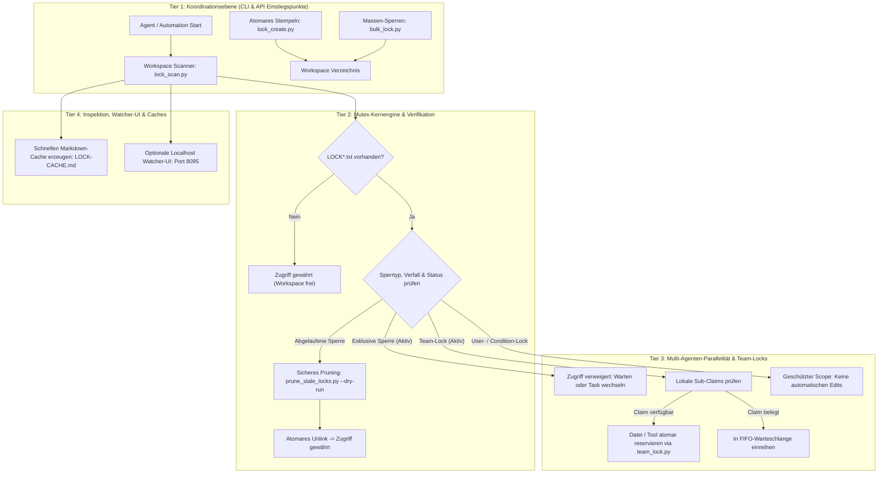

<p align="center"></p>

# lock-master

[](https://github.com/ellmos-ai/lock-master/actions/workflows/tests.yml)
[](#tests-ausführen)
[](https://www.python.org/downloads/)
[](https://github.com/ellmos-ai/lock-master)
[](https://github.com/astral-sh/ruff)
[](SECURITY.md)
[](SECURITY.md)
[](SECURITY.md)
[](THIRD_PARTY_LICENSES.md)
[](THIRD_PARTY_LICENSES.md)
[](NOTICE)
[](THIRD_PARTY_LICENSES.md)
[](MARKETING-LOG.txt)
[](VERSION)
[](LICENSE)
[](llms.txt)
[](https://github.com/ellmos-ai)
[](https://github.com/open-bricks)

[EN](README.md) | **DE** | [ES](README_es.md) | [JA](README_ja.md) | [RU](README_ru.md) | [ZH](README_zh-Hans.md)

**Portables, abhängigkeitsfreies Multi-Agenten-Datei-Sperrsystem — Exklusive und Team-Locks (`LOCK*.txt`) mit Scopes, Verfall, Stale-Bereinigung, Cloud-Sync-Unterstützung und schnellem Übersichtscache.**

> [!NOTE]
> **KI- / LLM-Indexierung**: KI-Agenten und automatisierte Werkzeuge können [llms.txt](llms.txt) für eine maschinenlesbare Zusammenfassung, Suchbegriffe und Disambiguation nutzen. Letzte Prüfung: **20.09.2026**.

### 🧭 Schnellnavigation

1. [Management-Zusammenfassung & Kernidentität](#management-zusammenfassung--kernidentitaet)
2. [Visuelle Architektur-Topologie & Entkoppelte Schichten](#visuelle-architektur-topologie)
3. [End-to-End Multi-Agenten-Sperr- & Lebenszyklus](#end-to-end-multi-agenten-sperr-lebenszyklus)
4. [Zielgruppen & High-Intent SEO-Suchanfragen](#marketing--zielgruppen)
5. [Vergleichsmatrix gegenüber Alternativen](#vergleichsmatrix-gegenueber-alternativen)
6. [Governance- & Laufzeit-Invarianten-Matrix](#governance--laufzeit-invarianten)
7. [Kernfähigkeiten & Sperrtypen](#kernfaehigkeiten--sperrtypen)
8. [Einstieg & Schnellreferenz](#einstieg)
9. [Schnellstart & Typische CLI-Workflows](#schnellstart)
10. [Konfigurationsreferenz (`lock_roots.json`)](#konfiguration)
11. [Optionale Watcher-UI & REST-API](#optionales-watcher-web-ui)
12. [Python-API & Erweiterungspunkte](#python-api)
13. [Dateistruktur, Module & Shims](#dateistruktur--shims)
14. [Tests, Verifikation & Quality-Gates](#tests-ausführen)
15. [Sicherheitsrichtlinie & Schwachstellen-SLAs](#sicherheitsrichtlinie)
16. [Drittanbieter-Lizenzen & Level 1 SBOM](#drittanbieter-lizenzen--transparenz)
17. [Ökosystem, Geschwisterwerkzeuge & Bündel](#ökosystem--geschwisterwerkzeuge)
18. [Gesetzliche Hinweise, Haftungsbeschränkung & Lizenz (§ 521 BGB)](#lizenz)

---

## <a id="management-zusammenfassung--kernidentitaet"></a><a id="auffindbarkeit-und-abgrenzung"></a><a id="was-ist-lock-master"></a>1. Management-Zusammenfassung & Kernidentität

`lock-master` bietet ein leichtgewichtiges, abhängigkeitsfreies Sperr- und Koordinationsprotokoll, maßgeschneidert für autonome KI-Coding-Agenten (Claude Code, OpenAI Codex, Antigravity/Gemini), automatisierte Hintergrund-Schleifen und Entwickler, die auf gemeinsamen Dateisystem-Arbeitsbäumen operieren.

Anstelle von schwergewichtigen Server-Diensten oder Datenbank-Systemen arbeitet `lock-master` mit transparenten, menschenlesbaren Klartextdateien (`LOCK*.txt`). Eine Sperrdatei in einem beliebigen Verzeichnis signalisiert: „Dieser Bereich oder diese Komponente ist belegt“ — und stellt strikt sicher, dass kein automatisierter Loop oder zweiter Agent Dateien in diesem Scope verändert, solange eine gültige, nicht abgelaufene Sperre vorliegt.

### Kernwerte & Differenzierung
- **100% Local-First & Zero-Egress**: Läuft vollständig innerhalb lokaler Dateisystemgrenzen ohne Netzwerkaufrufe, Telemetrie oder Cloud-Abhängigkeiten.
- **Null externe Laufzeit-Abhängigkeiten**: Reine Python-Standardbibliothek (3.10+) für alle Kernroutinen (Sperren, Scannen, Pruning).
- **Multi-Agenten- & Schwarm-fähig**: Integrierte Team-Locks (`LOCK.team.<host>.txt`) mit granularen Sub-Claims für Dateien, Verzeichnisse und MCP-Tools.
- **Cloud-Sync-resilient**: Speziell entwickelt für Latenzen bei Cloud-Speichern (OneDrive, Dropbox, Syncthing, Nextcloud) durch Rechner-spezifische Scopes und atomare Dateioperationen.
- **Fail-Closed-Sicherheit**: Bei Unklarheiten, Syntaxfehlern oder aktiven Sperren wird der Schreibzugriff strikt verweigert (Read-Only-Sicherheitsstandard).

---

## <a id="visuelle-architektur-topologie"></a><a id="features--architektur"></a>2. Visuelle Architektur-Topologie & Entkoppelte Schichten

Das folgende Architekturdiagramm veranschaulicht die vier entkoppelten Betriebsschichten von `lock-master`, von den CLI-/API-Einstiegspunkten bis zum persistenten Dateisystem-Status und den Inspektions-Tools:



---

## <a id="end-to-end-multi-agenten-sperr-lebenszyklus"></a><a id="team-lock--sub-claim-lebenszyklus"></a>3. End-to-End Multi-Agenten-Sperr- & Lebenszyklus

Das folgende Sequenzdiagramm zeigt, wie zwei autonome KI-Agenten in einem gemeinsamen Workspace interagieren — inklusive exklusiver Reservierung, Konflikterkennung, bereichsweiser Parallelisierung, Team-Sub-Claims und der Bereinigung verwaister Sperren:

```mermaid
sequenceDiagram
    autonumber
    actor AgentA as "Agent A (Claude Code)"
    participant LM as "lock-master Engine"
    participant FS as "Dateisystem / Cloud-Sync"
    actor AgentB as "Agent B (Codex CLI)"
    participant Pruner as "Stale Lock Pruner"

    Note over AgentA,FS: Phase 1: Vorprüfung & Exklusiver Lock-Erwerb
    AgentA->>LM: Workspace-Status prüfen: lock_utils.active_locks()
    LM->>FS: Nach aktiven LOCK*.txt suchen
    FS-->>LM: Workspace frei (0 Sperren)
    LM-->>AgentA: Zugriff gewährt (unlocked)
    AgentA->>LM: Scoped-Lock stempeln: lock_create.py --scope api
    LM->>FS: LOCK.api.txt atomar schreiben (TTL: 24h)
    FS-->>AgentA: Sperre bestätigt

    Note over AgentB,FS: Phase 2: Konflikt & Geteilte Parallelität
    AgentB->>LM: Versuch API-Modul zu ändern: lock_utils.active_locks()
    LM->>FS: LOCK.api.txt lesen (Aktiv, Inhaber: Claude Code)
    LM-->>AgentB: Zugriff verweigert (Konflikt: Scope api gesperrt)
    AgentB->>LM: Auf Docs-Modul ausweichen: lock_create.py --scope docs
    LM->>FS: LOCK.docs.txt atomar schreiben
    FS-->>AgentB: Zugriff gewährt (Paralleles Arbeiten)

    Note over AgentA,AgentB: Phase 3: Lokale Team-Koordination
    AgentA->>LM: Team-Präsenz registrieren: team_lock.py presence
    LM->>FS: LOCK.team.HOST_A.txt atomar schreiben
    AgentA->>LM: Datei beanspruchen: core/engine.py
    LM->>FS: Sub-Claim in LOCK.team.HOST_A.txt eintragen
    AgentB->>LM: Sub-Claims abfragen: team_lock.py claims
    LM-->>AgentB: core/engine.py belegt; tests/ verfügbar

    Note over AgentA,Pruner: Phase 4: Arbeitsabschluss & Sicheres Pruning
    AgentA->>FS: Refactoring abgeschlossen -> LOCK.api.txt entfernen
    alt Abgestürzter Prozess oder Deadlock
        Pruner->>LM: prune_stale_locks.py --dry-run ausführen
        LM->>FS: Zeitstempel gegen expires_after prüfen
        Pruner->>LM: prune_stale_locks.py ausführen
        LM->>FS: Abgelaufene LOCK.docs.txt atomar löschen
    else Reguläre Freigabe
        AgentB->>FS: LOCK.docs.txt bei Fertigstellung löschen
    end
```

---

## <a id="marketing--zielgruppen"></a><a id="zielgruppen--auffindbarkeit"></a>4. Zielgruppen & High-Intent SEO-Suchanfragen

`lock-master` wurde entwickelt, um kritische Nebenläufigkeits-, Koordinations- und Sicherheitsengpässe über vier primäre Anwenderprofile hinweg zu lösen:

### [PERSONA-01] Autonome KI-Agenten- & Multi-Agenten-Schwarm-Entwickler
- **Profil**: Leitende KI-Ingenieure und Framework-Entwickler (Claude Code, OpenAI Codex, Antigravity/Gemini), die Multi-Agenten-Schwärme auf gemeinsamen lokalen Git-Arbeitsbäumen koordinieren.
- **Herausforderungen**: Schwergewichtige verteilte Lock-Manager (Redis Redlock, etcd, Consul) erfordern Hintergrund-Dienste, geöffnete Netzwerk-Ports und Zugangsdaten und versagen in lokalen oder Offline-Umgebungen vollständig. Primitive Dateiflags führen zu Race Conditions und Deadlocks ohne TTL.
- **lock-master Lösung**: Transparente Klartext-Dateien (`LOCK*.txt` und `LOCK.<scope>.txt`), die von jedem LLM-Agenten oder Skript ohne externe Abhängigkeiten gelesen und geschrieben werden können. Autonomes Timeout-Handling, Dry-Run-Pruning verwaister Sperren und hierarchische Scopes ermöglichen sichere parallele Agenten-Arbeit ohne Kollisionen.

### [PERSONA-02] Cloud-Sync- & Multi-Device-Workspace-Entwickler
- **Profil**: Entwickler, die Code-Repositories über mehrere Rechner (Workstation, Laptop, Server) hinweg via OneDrive, Dropbox, Nextcloud oder Syncthing synchronisieren.
- **Herausforderungen**: Herkömmliche Betriebssystem-Dateisperren (`flock`, `fcntl`, `LockFileEx`) gelten nur lokal für einen OS-Kernel und synchronisieren sich nicht über Cloud-Speicher. Cloud-Sync-Latenzen (30s bis 5 Minuten) verursachen Konfliktkopien und inkonsistente Zustände.
- **lock-master Lösung**: Host-spezifische Team-Locks (`LOCK.team.<host>.txt`) mit lokalen Sub-Claims und atomaren Umbenennungsoperationen. Andere Rechner erkennen die aktive Sperre während der Synchronisationslatenz und halten Änderungen zurück.

### [PERSONA-03] Local-First-, Zero-Egress- & Air-Gapped-Entwickler
- **Profil**: Sicherheitsbewusste Softwareentwickler, MCP-Server-Autoren und Datenschutzbeauftragte mit strikt isolierten, telemetriefreien Systemen.
- **Herausforderungen**: Cloud-basierte Koordinationswerkzeuge senden Telemetriedaten, erfordern Netzwerkverbindungen und bringen komplexe Abhängigkeitsbäume mit Sicherheitsrisiken mit.
- **lock-master Lösung**: 100% Local-First und Zero-Egress (`INV-LOCAL-01`). Läuft strikt im unprivilegierten Benutzermodus (`RunAsInvoker` / `INV-SEC-02`) mit null externen Laufzeit-Abhängigkeiten (`dependencies = []`), verifiziert durch automatisierte AST-Import-Prüfungen.

### [PERSONA-04] Enterprise-Sicherheits-, Governance- & Compliance-Beauftragte
- **Profil**: DevSecOps-Manager, Compliance-Beauftragte und Plattform-Architekten mit Anforderungen an Nachvollziehbarkeit, Auditierbarkeit und Fail-Closed-Sicherheit.
- **Herausforderungen**: Undurchsichtige Datenbank-Sperren erschweren das Nachvollziehen von Deadlocks. Abgestürzte Prozesse hinterlassen unklare Sperrzustände.
- **lock-master Lösung**: Menschenlesbare ISO-Zeitstempel, deklarierte Eigentümer und Freigabebedingungen in Klartext. Deklarative Regelauswertung via `LOCK.permissions.json` (`deny` > `ask` > `allow`), deterministischer Verfall (TTL), Level 1 SBOM-Transparenz und garantierte Sicherheits-SLAs (48h Antwort / 5 Tage Triage).

### High-Intent SEO-Suchanfragen (Deutsch)
- `Multi-Agenten Datei Sperrsystem Python ohne Abhängigkeiten`
- `Claude Code Codex gemeinsames Workspace Locking Koordination`
- `Portables Local-First Mutex für KI Coding Agenten`
- `Cloud-Sync tolerantes Datei Locking OneDrive Dropbox Python`
- `Team-Lock Sub-Claims MCP Tool Mutex`
- `Fail-Closed deklarative Dateisperren Berechtigungen JSON`
- `Sicheres Aufräumen verwaister Sperren Python Dry-Run`

---

## <a id="vergleichsmatrix-gegenueber-alternativen"></a>5. Vergleichsmatrix gegenüber Alternativen

Die folgende Matrix vergleicht `lock-master` mit traditionellen Dateisperren, verteilten Systemen und Datenbanksperren anhand unserer 10 Governance- und Laufzeit-Invarianten (`INV-LOCAL-01` bis `INV-SLA-10`):

| # | Invariante & Bewertungsdimension | lock-master | OS Kernel Locking (`flock`/`fcntl`) | Verteilte Locks (Redis Redlock/etcd) | DB Advisory Locks (SQLite/Postgres) | Ad-Hoc Skripte / Shell Flag-Dateien |
|---|:---|:---:|:---:|:---:|:---:|:---:|
| 1 | **INV-LOCAL-01: Zero-Egress & 100% Local-First** |  Null Netzwerkaufrufe |  Nur lokaler Kernel | ❌ Erfordert Netzwerk-Daemon | ⚠️ Erfordert DB-Engine |  Lokale Dateien |
| 2 | **INV-SEC-02: Unprivilegiertes `RunAsInvoker`** |  Benutzermodus (kein Root) |  Kernel-Berechtigungsgrenzen | ⚠️ Service-Daemon-Zugangsdaten |  DB-Benutzerrechte |  Benutzermodus |
| 3 | **INV-FAIL-03: Fail-Closed Default-Semantik** |  Verweigerung bei Fehlern/Zweifel | ⚠️ Kernel-Fehlercodes | ⚠️ Split-Brain-Risiko bei Partition | ⚠️ Verhalten bei Verbindungsabbruch | ❌ Race Conditions / Fail-Open |
| 4 | **INV-SCOPE-04: Hierarchisches & Scoped Locking** |  Projekt- & Komponenten-Scopes | ❌ Nur einzelne Dateideskriptoren | ⚠️ Manuelle Key-Namensräume | ⚠️ Nur Tabellen-/Zeilenscope | ❌ Statische Dateinamen |
| 5 | **INV-TEAM-05: Cloud-Sync & Multi-Host-Toleranz** |  Host-spezifische Team-Locks | ❌ Versagt bei Cloud-Sync | ❌ Ungeeignet für lokale Sync-Ordner | ❌ Hohes DB-Korruptionsrisiko | ❌ Extrem fehleranfällig |
| 6 | **INV-TTL-06: Deterministische TTL & Dry-Run** |  Explizite TTL & Dry-Run-Pruning | ❌ An Prozess-Lebensdauer gebunden | ⚠️ Key-TTL (kein Dry-Run-Review) | ⚠️ An Session/Verbindung gebunden | ❌ Verwaiste Sperren bleiben |
| 7 | **INV-PERM-07: Deklarative Zugriffsberechtigungen** |  `LOCK.permissions.json` Engine | ❌ Nur OS-Dateirechte | ⚠️ ACL / Auth-Policies | ⚠️ DB-Rollenberechtigungen | ❌ Keine |
| 8 | **INV-AUDIT-08: Menschenlesbar & Atomarer Cache** |  Klartext & `LOCK-CACHE.md` | ❌ Binärer Kernel-Zustand | ❌ Undurchsichtiger Key-Value-Store | ❌ Binäre Datenbanktabellen | ⚠️ Fragile Textdateien |
| 9 | **INV-LIC-09: 100% Permissiv & Zero-Copyleft** |  MIT-Lizenz (0% Copyleft) |  OS-Herstellerlizenz | ⚠️ BSD / SSPL / Apache | ⚠️ Public Domain / PostgreSQL |  Unspezifiziert |
| 10 | **INV-SLA-10: 48h Antwort / 5 Tage Triage SLA** |  Kodifiziertes formales SLA | ❌ Upstream OS-Hersteller | ⚠️ Nur kommerzieller Support | ⚠️ Community-Foren | ❌ Kein Wartungs-SLA |

---

## <a id="governance--laufzeit-invarianten"></a>6. Governance- & Laufzeit-Invarianten-Matrix

`lock-master` garantiert 10 fundamentale Laufzeit- und Governance-Invarianten über alle Module, CLI-Befehle und Koordinationsschichten hinweg:

| Kanonische ID | Invarianten-Titel | Zentrale Betriebsgarantie |
|:---|:---|:---|
| **INV-LOCAL-01** | **100% Local-First & Zero-Egress** | Arbeitet strikt auf lokalen Dateisystemen (einschließlich Cloud-Sync-Mounts wie OneDrive/Dropbox). Überträgt niemals Telemetrie, Metriken oder Daten ins Netzwerk. |
| **INV-SEC-02** | **Unprivilegierte Ausführung (`RunAsInvoker`)** | Läuft vollständig im unprivilegierten Benutzermodus. Verlangt niemals Administrator-Rechte, Sudo oder Root-Zugriff. |
| **INV-FAIL-03** | **Fail-Closed Sperrsemantik** | Bei unklaren Sperrzuständen, Syntaxfehlern oder aktiven Sperren wird der Zugriff strikt verweigert (sicherer Read-Only-Standard). |
| **INV-SCOPE-04** | **Hierarchisches & Scoped Locking** | `LOCK.txt` im Root sperrt das gesamte Projekt; `LOCK.<scope>.txt` ermöglicht paralleles Arbeiten an getrennten Modulen. |
| **INV-TEAM-05** | **Multi-Agenten-Team-Koordination** | `LOCK.team.<host>.txt` koordiniert Agenten auf demselben Rechner (Präsenz, Datei-Claims, Tools) und signalisiert Peer-Systemen, während der Sync-Latenz fernzubleiben. |
| **INV-TTL-06** | **Deterministische TTL & Stale-Bereinigung** | Jede Sperre besitzt eine konfigurierbare `expires_after`-Dauer (Standard 24h); verwaiste Sperren werden sicher mit `--dry-run` geprüft und atomar entfernt. |
| **INV-PERM-07** | **Deklarative Berechtigungs-Engine** | Wertet Aktionen gegen `LOCK.permissions.json` mit strikter Priorität (`deny` > `ask` > `allow` > Default) und Regex-Pfadprüfung aus. |
| **INV-AUDIT-08** | **Read-Only-Inspektion & Atomarer Cache** | `lock_scan.py` liest rein passiv; Cache-Exporte (`LOCK-CACHE.md`) werden atomar geschrieben, ohne aktive Sperren zu beeinflussen. |
| **INV-LIC-09** | **100% Permissiver Abhängigkeits-Stack** | Null externe Laufzeit-Abhängigkeiten (reine Python-Standardbibliothek); Entwicklungs- und Test-Tools sind streng nach MIT/PSFL/BSD-3-Clause auditiert. |
| **INV-SLA-10** | **Duales Sicherheits-Response-SLA** | Verlässliche Reaktionszeit von 48 Stunden und 5 Werktagen Triage über kanonische Sicherheitskontakte (`security@open-bricks.org`, `security@ellmos.ai`). |

---

## <a id="kernfaehigkeiten--sperrtypen"></a><a id="kernfaehigkeiten"></a>7. Kernfähigkeiten & Sperrtypen

### Sperrtypen

- **Exklusive Sperre (`LOCK.txt`)**: Sperrt das gesamte Projektverzeichnis für alle Systeme und Agenten.
- **Scoped-Sperre (`LOCK.<scope>.txt`)**: Sperrt nur eine definierte Teilkomponente (z. B. `LOCK.api.txt`, `LOCK.docs.txt`) und erlaubt paralleles Arbeiten an getrennten Bereichen.
- **Team-Lock (`LOCK.team.<host>.txt`)**: Koordiniert mehrere Agenten auf demselben System. Vereint Präsenzliste, Datei-Claims, MCP-/Tool-Sperren und Mitteilungen in einer Datei und hält Remote-Systeme fern.
- **User-Lock (`LOCK.user.txt`)**: Manuell von einem menschlichen Benutzer gesetzt. Läuft niemals zeitlich ab und wird nicht automatisch bereinigt.
- **Condition-Lock (`LOCK.condition.<name>.txt`)**: Blockiert eine Operation, bis eine explizite reale Bedingung erfüllt ist (`release_condition: PR merged`). Besitzt keinen Zeitverfall.

### Dateiformat-Spezifikation

Reines UTF-8 ohne BOM, Schlüssel-Wert-Paare im Format `key: value`:

```text
owner: my-agent
created: 2026-06-14T10:00
host: workstation
expires_after: 24h
mode: hard
purpose: Refactoring der Authentifizierungsschicht
release_condition: PR merged
operations: git-push, deploy
```

| Feld | Pflicht | Beispiel | Beschreibung |
|:---|:---|:---|:---|
| `owner` | Ja | `claude-code`, `user` | Inhaber der Sperre. |
| `created` | Ja | `2026-06-14T10:00` | ISO-8601-Zeitstempel für die TTL-Berechnung. |
| `host` | Optional | `WORKSTATION-LG`, `LAPTOP` | Rechnerkennung (wichtig in Multi-Device-Umgebungen). |
| `expires_after` | Optional | `24h`, `90m`, `2d` | TTL-Dauer (Standard: `24h`). Bei User-/Condition-Locks ignoriert. |
| `purpose` | Optional | `Refactoring Auth-Modul` | Freitext-Beschreibung der aktuellen Aufgabe. |
| `mode` | Optional | `hard` \| `soft` | `hard` = keine Schreibzugriffe (Standard); `soft` = Lese-/Hinweismodus. |
| `release_condition` | Optional* | `Alle CI-Tests bestanden` | Pflichtfeld bei Condition-Locks. |
| `operations` | Optional | `publish, push` | Kommagetrennte Liste gesperrter Aktionen; ungelistete bleiben erlaubt. |

---

## <a id="einstieg"></a>8. Einstieg & Schnellreferenz

| Typischer Bedarf | Empfohlene Aktion | Befehl / Verwendung |
|:---|:---|:---|
| Gleichzeitiges Bearbeiten eines Repos durch zwei Agenten verhindern | Exklusive Root-Sperre setzen | `python lock_create.py <projekt>` |
| Paralleles Arbeiten an getrennten Modulen ermöglichen | Scoped-Sperre setzen | `python lock_create.py <projekt> --scope api` |
| Aktive Sperren über alle Projektbäume hinweg prüfen | Read-Only Scanner ausführen | `python lock_scan.py` |
| Schnellen, menschenlesbaren Markdown-Status exportieren | Cache generieren | `python lock_scan.py --write-cache` |
| Verwaiste Sperren sicher einsehen | Stale-Locks previewen | `python prune_stale_locks.py --dry-run` |
| Verwaiste Sperren sicher löschen | Stale-Cleanup ausführen | `python prune_stale_locks.py` |
| Multi-Agenten-Schwarm auf einem Rechner koordinieren | Host-Team-Lock erzeugen | `python lock_create.py <projekt> --team <HOST>` |

---

## <a id="schnellstart"></a>9. Schnellstart & Typische CLI-Workflows

### 1. Skripte kopieren oder bereitstellen

Alles für das Kernlocking Notwendige liegt in `pure-locking/`:

```bash
pure-locking/lock_utils.py
pure-locking/lock_scan.py
pure-locking/prune_stale_locks.py
pure-locking/LOCK_TEMPLATE.txt
```

Platziere die Dateien nebeneinander in deinem Tool-Verzeichnis oder nutze die Shims im Root des Repositories.

### 2. Status vor Arbeitsbeginn prüfen

```bash
# Prüfen, ob das aktuelle Verzeichnis gesperrt ist
python lock_scan.py --check-dir .
echo $?  # 0 = frei für Bearbeitung; 1 = gesperrt
```

### 3. Neue Sperre setzen

```bash
# Exklusive Projekt-Sperre
python lock_create.py /pfad/zum/projekt --owner "claude-code" --purpose "Parser Refactoring"

# Scoped-Sperre für eine Teilkomponente
python lock_create.py /pfad/zum/projekt --scope frontend --owner "codex" --purpose "UI Redesign"
```

### 4. Workspace-Hierarchie scannen

```bash
# Menschenlesbare Konsolenausgabe
python lock_scan.py

# Maschinenlesbares JSON für Automatisierungen
python lock_scan.py --json
```

### 5. Verwaiste Sperren sicher bereinigen

```bash
# Vorschau ohne Änderungen (empfohlen)
python prune_stale_locks.py --dry-run

# Abgelaufene Sperren atomar entfernen
python prune_stale_locks.py
```

---

## <a id="konfiguration"></a>10. Konfigurationsreferenz (`lock_roots.json`)

Für das Scannen mehrerer Projektbäume kopiere `pure-locking/lock_roots.example.json` nach `lock_roots.json`:

```json
{
  "default_max_depth": 4,
  "shallow_depth": 2,
  "skip_dirs": [".git", ".venv", "node_modules", "__pycache__", "build", "dist"],
  "roots": [
    { "path": "C:/_Local_DEV/repos" },
    { "path": "C:/Users/user/OneDrive/Projekte", "shallow": true }
  ],
  "caches": [
    {
      "name": "system-wide",
      "path": "C:/_Local_DEV/state/LOCK-CACHE.md"
    }
  ]
}
```

| Schlüssel | Typ | Standard | Beschreibung |
|:---|:---|:---|:---|
| `default_max_depth` | int | `4` | Maximale Rekursionstiefe für reguläre Scan-Roots. |
| `shallow_depth` | int | `2` | Begrenzte Rekursionstiefe für Roots mit `"shallow": true`. |
| `skip_dirs` | string[] | `[]` | Verzeichnisnamen, die beim Scan vollständig ignoriert werden. |
| `roots` | object[] | `[]` | Liste von `{ "path": string, "shallow": bool }` Definitionen. |
| `caches` | object[] | `[]` | Zielpfade für exportierte Markdown-Status-Caches. |

---

## <a id="optionales-watcher-web-ui"></a>11. Optionale Watcher-UI & REST-API

Für die visuelle Flottenüberwachung bietet `pure-locking/watcher/` ein optionales Localhost-Dashboard und eine REST-API auf `127.0.0.1:8095`:

```bash
# Hintergrund-Cache-Daemon starten
python pure-locking/watcher/lock_watcher.py --update-cache

# Lokalen Webserver starten
python pure-locking/watcher/web_server.py --port 8095
```

Öffne `http://127.0.0.1:8095` im Browser, um aktive Sperren, Raumkarten, Live-Timelines einzusehen und sichere Dry-Run-Bereinigungen anzustoßen.

---

## <a id="python-api"></a>12. Python-API & Erweiterungspunkte

Direkte programmgesteuerte Integration über `lock_utils`:

```python
from pathlib import Path
from datetime import datetime
import lock_utils

project_dir = Path("/pfad/zu/meinem-repo")

# 1. Sperrstatus des Workspaces abfragen
active = lock_utils.active_locks(project_dir)
if active:
    print(f"Workspace gesperrt durch: {[str(p.name) for p in active]}")
else:
    print("Workspace ist frei für Bearbeitung.")

# 2. Metadaten einer Sperre einlesen
lock_data = lock_utils.parse_lock_file(project_dir / "LOCK.txt")
print(f"Inhaber: {lock_data['owner']}, Erstellt: {lock_data['created']}, Zweck: {lock_data['purpose']}")

# 3. Verfall prüfen
if lock_utils.is_expired(project_dir / "LOCK.txt", now=datetime.now()):
    print("Sperre ist gemäß TTL-Dauer abgelaufen.")
```

---

## <a id="dateistruktur--shims"></a>13. Dateistruktur, Module & Shims

`lock-master` ist modular in drei entkoppelte Submodule aufgeteilt, die über Shims im Root nahtlos kompatibel bleiben:

```text
lock-master/                        # Modularer Stack als EIN Repository
├── pure-locking/                   # Kernmodul: Sperren, Scannen, Pruning
│   ├── lock_utils.py               # Kernbibliothek: Parser, Scopes, Expiry, Team-Helfer
│   ├── lock_scan.py                # CLI: Aktive Sperren listen, Cache schreiben
│   ├── prune_stale_locks.py        # CLI: Abgelaufene Sperren löschen (--dry-run)
│   ├── lock_create.py              # CLI: Korrekte Sperrdateien stempeln
│   ├── bulk_lock.py                # CLI: Massen-Sperren/Entsperren
│   ├── watcher/                    # Optionale Localhost-Daemon, REST-API & Web-UI
│   ├── LOCK_TEMPLATE.txt           # Vorlage für exklusive Sperren
│   ├── TEAM_LOCK_TEMPLATE.txt      # Vorlage für Team-Locks
│   └── lock_roots.example.json     # Beispiel-Konfiguration
├── permission-control/             # Regelwerk LOCK.permissions.json
│   ├── permissions.py              # allow / deny / ask Regelauswertung
│   └── LOCK_PERMISSIONS_TEMPLATE.json
├── team-lock/                      # Team-Lock CLI & lokale Nebenläufigkeit
│   ├── team_lock.py                # CLI für Team-Claims & FIFO-Warteschlangen
│   └── _lock_master_team/          # FIFO-Queue, OS-Guard, atomare Dateischreiber
│
├── lock_scan.py                    # Root-Kompatibilitäts-Shim
├── lock_utils.py                   # Root-Kompatibilitäts-Shim
├── lock_create.py                  # Root-Kompatibilitäts-Shim
├── bulk_lock.py                    # Root-Kompatibilitäts-Shim
├── prune_stale_locks.py            # Root-Kompatibilitäts-Shim
├── permissions.py                  # Root-Kompatibilitäts-Shim
├── team_lock.py                    # Root-Kompatibilitäts-Shim (CLI: lock-master-team)
│
├── LOCK-SYSTEM.md                  # Kanonische Spezifikation & Lifecycle
├── NOTICE                          # Offizielle Attribution (Lukas Geiger, ellmos-ai, open-bricks)
├── THIRD_PARTY_LICENSES.md         # Level 1 SBOM, Lizenz-Audit & Invarianten-Matrix
├── MARKETING-LOG.txt               # Zielgruppen, SEO-Queries & Differenzierung
├── SECURITY.md                     # Sicherheitsrichtlinie, SLAs & Schwachstellenmeldung
├── llms.txt                        # KI-Agenten Entdeckungsindex & Kontext
├── pyproject.toml                  # PEP 517/621/639 Paketkonfiguration
└── tests/                          # Automatisierte Regressions- & Vertragstests
```

---

## <a id="tests-ausführen"></a>14. Tests, Verifikation & Quality-Gates

Die standardisierte Pytest-Testsuite lokal ausführen:

```bash
# Alle Unit-, Funktions- und Metadaten-Vertragstests ausführen
python -m pytest tests/ -v

# Ruff Linter-Prüfung durchführen
python -m ruff check .
```

Unsere Continuous-Integration-Matrix garantiert:
- Multi-OS Validierung (Ubuntu, Windows, macOS).
- Python-Matrix (3.10, 3.11, 3.12, 3.13).
- Bytecode-Kompilierungsprüfung (`python -m compileall -q .`).
- Isolierte Wheel-Packaging-Smoke-Tests.
- 100% strikte Einhaltung der Ruff-Codestyle-Regeln.

---

## <a id="sicherheitsrichtlinie"></a>15. Sicherheitsrichtlinie & Schwachstellen-SLAs

Sicherheitsrelevante Meldungen werden nach strikten Zero-Egress- und Local-First-Prinzipien behandelt. Siehe [SECURITY.md](SECURITY.md) für Meldeverfahren, PGP-Schlüssel und unsere verbindlichen SLAs:
- **Erste Rückmeldung**: Innerhalb von **48 Stunden** (`security@open-bricks.org`, `security@ellmos.ai`).
- **Triage & Einstufung**: Innerhalb von **5 Werktagen**.
- **Behebungsziel**: Patches bereitgestellt innerhalb von maximal **30 Kalendertagen**.

---

## <a id="drittanbieter-lizenzen--transparenz"></a><a id="drittanbieter-lizenzen--level-1-sbom"></a>16. Drittanbieter-Lizenzen & Level 1 SBOM

`lock-master` garantiert **null externe Laufzeit-Abhängigkeiten** (`dependencies = []` in `pyproject.toml`) und setzt ausschließlich auf freie, permissive Open-Source-Lizenzen (MIT, Apache-2.0, PSFL, BSD-3-Clause). Das Projekt enthält **keinerlei GPL- oder Copyleft-Komponenten**.

Das vollständige Level 1 Software Bill of Materials (SBOM), das Lizenz-Audit und die Invarianten-Referenzmatrix (`INV-LOCAL-01` bis `INV-SLA-10`) sind in [THIRD_PARTY_LICENSES.md](THIRD_PARTY_LICENSES.md) dokumentiert.

---

## <a id="ökosystem--geschwisterwerkzeuge"></a>17. Ökosystem, Geschwisterwerkzeuge & Bündel

`lock-master` ist ein zentraler Baustein des [ellmos-ai](https://github.com/ellmos-ai) Multi-Agenten-Ökosystems und des übergeordneten [open-bricks](https://github.com/open-bricks) Software-Verbunds:

| Geschwisterwerkzeug | Organisation | Rolle & Leistungsumfang |
|:---|:---|:---|
| [ticket-master](https://github.com/ellmos-ai/ticket-master) | ellmos-ai | Autonome Ticket-Routing- und Task-Dispatching-Konsole |
| [clutch](https://github.com/ellmos-ai/clutch) | ellmos-ai | Adaptiver Multi-Modell LLM Router & Ausführungsschaltung |
| [coma](https://github.com/ellmos-ai/coma) | ellmos-ai | Autonomer Multi-Agenten-Orchestrator & Single-Binary-Koordinator |
| [swarm-ai](https://github.com/ellmos-ai/swarm-ai) | ellmos-ai | Schwarmintelligenz und autonomer Agenten-Konsens |
| [gardener](https://github.com/ellmos-ai/gardener) | ellmos-ai | Local-First Session- und Kontextspeicher für Agenten |
| [system-gap-master](https://github.com/ellmos-ai/system-gap-master) | ellmos-ai | Serverlose Multi-Agenten-Workspace-Synchronisation & Reconciliation |
| [system-explorer](https://github.com/ellmos-ai/system-explorer) | ellmos-ai | Evidenzbasierte Funktionsauflösung & Drift-Auditierung |
| [open-compute-mcp](https://github.com/ellmos-ai/open-compute-mcp) | ellmos-ai | Sichere Bedienerinteraktion, Signalüberlagerung & MCP-Compute-Brücke |
| [ellmos-filecommander-mcp](https://github.com/ellmos-ai/ellmos-filecommander-mcp) | ellmos-ai | Hochperformante Dateisystem- und Workspace-Operationen via MCP |
| [ellmos-codecommander-mcp](https://github.com/ellmos-ai/ellmos-codecommander-mcp) | ellmos-ai | Semantische Codeanalyse, AST-Inspektion & Refactoring MCP-Server |
| [n8n-manager-mcp](https://github.com/ellmos-ai/n8n-manager-mcp) | ellmos-ai | Sicherheitsüberwachter n8n-Workflow-Manager & Orchestrator |
| [prompt-evidence-collector](https://github.com/ellmos-ai/prompt-evidence-collector) | ellmos-ai | Auditfähige Erfassung von LLM-Interaktionen & Evidenz-Store |
| [policy-registry](https://github.com/ellmos-ai/policy-registry) | ellmos-ai | Einheitliche Agenten-Berechtigungs- und Richtlinienverwaltung |
| [sqlite-transit-sync](https://github.com/ellmos-ai/sqlite-transit-sync) | ellmos-ai | Multi-Agenten Zustandssynchronisation via SQLite-WAL-Journale |
| [workflowhooker](https://github.com/ellmos-ai/workflowhooker) | ellmos-ai | Ereignisgesteuerte Hooks und Agenten-Workflow-Trigger |
| [memoryhooker](https://github.com/ellmos-ai/memoryhooker) | ellmos-ai | Transparente SQLite/FTS5 Arbeitsgedächtnis-Erfassung |
| [DevCenter](https://github.com/dev-bricks/DevCenter) | dev-bricks | Entwickler-Leitstand, Repository-Dashboard & Umgebungsmanager |
| [CodeBox](https://github.com/dev-bricks/CodeBox) | dev-bricks | Polyglotter Code-Snippet-Manager & Entwickler-Werkbank |
| [safe-start-for-codex](https://github.com/dev-bricks/safe-start-for-codex) | dev-bricks | Sicherer Starter und Berechtigungs-Isolator für Codex-Sessions |
| [automation-master](https://github.com/dev-bricks/automation-master) | dev-bricks | Automations-Orchestrierung und lokaler Job-Scheduler |
| [CleanMarkdown](https://github.com/doc-bricks/CleanMarkdown) | doc-bricks | Markdown-Formatierung, Linting und strukturelle Bereinigung |
| [PDFtoPDFocr](https://github.com/doc-bricks/PDFtoPDFocr) | doc-bricks | PDF-OCR-Verarbeitung, durchsuchbare Textebenen & Validierung |
| [open-bricks](https://github.com/open-bricks/open-bricks) | open-bricks | Dachkatalog & anwendungsübergreifendes Architektur-Register |

---

## <a id="lizenz"></a><a id="gesetzliche-hinweise-haftungsbeschraenkung--lizenz"></a>18. Gesetzliche Hinweise, Haftungsbeschränkung & Lizenz (§ 521 BGB)

### Gesetzliche Hinweise & Haftungsbeschränkung (§ 521 BGB)
Die Bereitstellung dieser Software erfolgt unentgeltlich im Sinne einer Gefälligkeit bzw. Schenkung gemäß **§ 521 BGB** (Gefälligkeitsrecht / unentgeltliche Schenkung). Die Haftung des Autors und der Mitwirkenden ist daher auf Vorsatz und grobe Fahrlässigkeit beschränkt.

### Lizenz
Dieses Projekt ist unter den Bedingungen der **MIT-Lizenz** lizenziert. Siehe [LICENSE](LICENSE) und [NOTICE](NOTICE) für vollständige Urheberrechtsangaben.
